# CRT Player

A desktop video player for Linux (built for Bazzite) whose defining feature is a
configurable, GPU-rendered CRT presentation that respects every aspect ratio:
4:3, 16:9, ultrawide, vertical, anamorphic and rotation-tagged phone video.

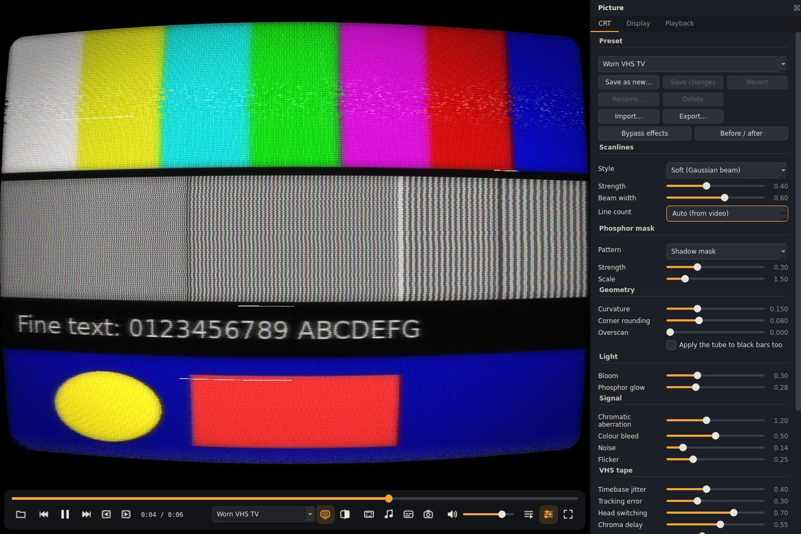

- **Uses your system's codecs.** Playback runs on the host's GStreamer and whatever
  plugins are installed. Nothing is bundled.
- **Never distorts by default.** It reads display aspect ratio, pixel aspect ratio and
  rotation metadata. The Original, Fit, Fill and Crop modes all preserve proportions.
- **CRT effects apply to the picture, not the window.** By default the tube hugs the
  picture and letterbox or pillarbox bars stay flat and black. Curvature and masks scale
  with the displayed picture. Curvature never crops content; only Overscan and Fill do,
  and only when you choose them.
- **Analog source simulation**: VHS tape distortion (jitter, tracking error, head
  switching, chroma delay, dropouts, tape softness) and composite / LaserDisc
  artifacts (dot crawl, rainbow crosstalk, laser rot). They are applied to the signal
  *before* the tube, so they bend with the curvature and pass through the scanlines
  and mask like real content.
- **Everyday playback:** resume where you left off, recent files, external subtitle
  files, playback speed (pitch preserved), A–B loop, chapters, and preview thumbnails on
  the seek bar. Subtitles are off until you ask for them and then stay as you set them,
  in the language you picked, from video to video and channel to channel; after a jump
  the line that belongs to the place is on screen at once. Also: sound
  and subtitle delay, subtitle size and colour, night mode, deinterlacing, shuffle and
  repeat, playlist files, carrying on with the next video in a folder, and a sleep
  timer.
- **Videos from web sites:** paste a link with **Ctrl+V** (or press **Ctrl+L**) and the
  video plays in the player, with whatever look is on: YouTube and the many other sites
  [yt-dlp](https://github.com/yt-dlp/yt-dlp) knows. Subtitles, chapters, playlists and
  "go on where I left off" work as for files. See [Videos from web sites](#videos-from-web-sites).
- **Made for Bazzite:** game controllers (Xbox, PlayStation, Switch, Steam Deck), media
  keys and KDE's media widget / KDE Connect (MPRIS), and Steam Game Mode, with a room
  backdrop for desk mode.
- **Jellyfin.** Sign in to your Jellyfin server, browse libraries with posters,
  search, continue watching, and stream videos in their original format (decoded
  locally, with every CRT effect). Watch progress syncs back to the server.
- **The look's sound:** looks change the sound as well as the picture.
  - **VHS** hisses, wobbles (wow and flutter), saturates warmly, loses its treble, and
    plays through a small TV speaker. The tape's dropouts dip the sound too.
  - **TV looks** sound like a TV's small, boxy speaker (mono when full).
  - **Film prints** crackle and pop, with a softer top end.
  - **Adjusting it:** *Settings → CRT → Sound* has a slider for each.
  - **Levels:** *Settings → Playback → Sound* has two controls that work on top of any
    look, and are remembered:
    - **Noise volume** (0–200 %): how loud the tape hiss and film crackle are.
    - **Effect strength** (0–100 %): how strongly the TV speaker, treble loss, pitch
      wobble, saturation and dropouts change the sound.
  - **Switching it off:** *Settings → Playback → Sound → The look's sound* turns the sound
    effects off while keeping the picture.
  - **Clean looks** leave the sound untouched, bit for bit.
- **Film projection:** grain, gate weave (the frame drifting in the projector's gate),
  projector flicker, and dust and scratches, at 24 film frames per second.
  - **Presets:** *Film Print (35mm)*, *Worn Film (16mm)* and *Drive-in Movie*.
  - **In desk mode,** the movie theater scene uses them.
- **Deeper simulation.** Phosphor persistence (afterglow trails), reduced colour depth
  (15-bit down to 3-bit, plus Game Boy, CGA and EGA palettes) with ordered dithering,
  PAL mode, and set moments: a power-on/off animation, static between playlist items,
  and a VCR on-screen display.
- **Lower resolution / bigger pixels.** Render the video at 240, 224, 160… rows (or
  exact sizes like 256×224 and 320×200), with hard, sharp or soft pixels. Scanlines lock
  to one line per pixel row.
- **Sega CD FMV look.** Video the way an early-90s CD console played it: a 256×224
  screen, a blocky 4×4 codec, about 64 colours picked to suit the picture and
  dithered, 15 frames a second, 8-bit sound. See [Sega CD FMV look](#sega-cd-fmv-look).
- **Cable TV.** Folders of videos (and Jellyfin libraries) become channels that
  broadcast around the clock. Tune in and a programme is already partway through; flip
  channels through static, and bring up a scrolling programme guide.
  See [Cable TV](#cable-tv).
- **Cut and clip.** Cut a section into a new file without re-encoding, or save it as an
  animated GIF with the look, at any size up to 4K.
- **Eleven scanline styles.** Six original ones: Soft, Sharp, Dynamic, Interlaced,
  VGA double-scan and Pixel beam. Five emulator looks modelled on well-known RetroArch
  and MAME shaders: Geom-, Lottes-, Easymode-, Hyllian- and MAME HLSL-style. These are
  independent implementations, not ports; see
  [Emulator scanline looks](#emulator-scanline-looks).
- **Desk mode** (optional, press **T**): the video plays on a 3D set that stands on your
  desktop: a CRT television, a flat-face CRT, a flat panel, an 80s wood-grain console, a
  broadcast monitor, a beige PC monitor or an upright arcade cabinet, with no window around it. Turn it and move it with the mouse,
  then double-click to fly into the screen; the flight lands exactly on the normal
  fullscreen image. The regular player window is unchanged and comes back when you
  leave desk mode.
- **Hardware decoding when available**, with automatic fallback to software if a
  hardware decoder fails.
- **Enhance** (for a graphics card, optional): **sharper upscaling** for DVDs and 720p video
  on a big screen, and **smooth motion**, which generates the pictures in between a film's
  24 or 30 frames a second so that motion is as smooth as the screen allows.
  With an NVIDIA RTX card and NVIDIA's Video Effects SDK installed (free, a separate
  download), both are done by **NVIDIA's AI models** instead: Video Super Resolution and
  Video Frame Generation.
  See [Enhance](#enhance-sharper-upscaling-and-smooth-motion).
- **Plays without a graphics card.** In a virtual machine without 3D acceleration (or
  anywhere OpenGL runs in software), the player moves colour conversion and scaling onto
  all your CPU cores and, with effects off, paints the picture without OpenGL at all.
  See [Without a graphics card](#without-a-graphics-card).
- **Wayland and X11**, through Qt 6.

---

## Contents

1. [Run on Bazzite](#run-on-bazzite) (AppImage or binary)
   - [Windows 10 and 11 (preview)](#windows-10-and-11-preview)
2. [Build from source](#build-from-source)
3. [Dependencies](#dependencies)
4. [Controls](#controls)
5. [Scaling and aspect ratio](#scaling-and-aspect-ratio)
6. [CRT presets and parameters](#crt-presets-and-parameters)
7. [Screenshots, frame stepping, playlist](#screenshots-frame-stepping-playlist)
   - [Cutting without re-encoding, and GIF clips](#cutting-without-re-encoding-and-gif-clips)
   - [Without a graphics card](#without-a-graphics-card)
   - [4K HEVC 10-bit (2.17)](#4k-hevc-10-bit-217)
   - [Enhance: sharper upscaling and smooth motion](#enhance-sharper-upscaling-and-smooth-motion)
   - [NVIDIA AI upscaling and frame generation (RTX cards)](#nvidia-ai-upscaling-and-frame-generation-rtx-cards)
8. [Desk mode: a 3D TV on your desktop](#desk-mode-a-3d-tv-on-your-desktop)
9. [Cable TV](#cable-tv)
10. [Jellyfin](#jellyfin)
11. [Videos from web sites](#videos-from-web-sites) (YouTube and others, through yt-dlp)
12. [Where settings are stored](#where-settings-are-stored)
13. [Troubleshooting](#troubleshooting)
14. [Code layout](#code-layout)
15. [Verification](#verification)

The rendering pipeline is explained in [docs/PIPELINE.md](docs/PIPELINE.md).
The scripted test driver is documented in [docs/AUTOMATION.md](docs/AUTOMATION.md).

---

## Windows 10 and 11 (preview)

**What it is:** a self-contained folder for 64-bit Windows 10 and 11. It carries its own
Qt and GStreamer (with all the usual codecs), so there is nothing else to install.

**Getting it:** each build on GitHub produces `CRT_Player-<version>-windows-x64.zip`
(under *Actions*, or *Releases* for tagged versions).

1. Unzip it anywhere.
2. Run `crtplayer.exe` from the `CRT Player` folder.
3. Windows may warn about an unrecognised app the first time. Choose *More info → Run
   anyway*: the build isn't code-signed.

**What's different on Windows:**

- **Hardware decoding** uses Direct3D 11 (`d3d11h264dec` and friends).
- **Keeping the screen awake** while a video plays uses Windows' own setting.
- **Game controllers** work through SDL, which ships in the folder.
- **Settings** are stored in the registry (`HKEY_CURRENT_USER\Software\CRTPlayer`).
- **Needs OpenGL 3.3**, which every graphics driver from the last decade provides. A PC
  running on Windows' basic display driver (no graphics driver installed) gets a message
  saying so instead of a picture: install the driver from the card's maker.
- **No sound device** (no speakers, audio service stopped): the video still plays, silently.
- **Full screen and desk mode stop one pixel short of the screen's edge** (2.16.1). Windows'
  graphics drivers treat a window that draws with OpenGL and exactly covers the screen as a
  full-screen game, and stop mixing it with the rest of the desktop. Lists and menus opened over
  the video were then there (you could click their lines) but not seen, and desk mode showed
  black around the set instead of the desktop, and ran unevenly. The one-pixel edge is Qt's
  own remedy: with it the window stays an ordinary one. To switch it off, should it ever be in
  the way, start the player from a Command Prompt opened in its folder:

  ```
  set CRTPLAYER_FULLSCREEN_BORDER=0
  ```

  ```
  crtplayer.exe
  ```
- **Videos from web sites** work as on Linux. *Get yt-dlp* fetches `yt-dlp.exe` (and
  `deno.exe`) into `%APPDATA%\CRTPlayer\CRTPlayer\tools`; a `yt-dlp.exe` you put beside
  `crtplayer.exe`, or one on the `PATH`, is found too.
- **Not yet:** media keys and Windows' media overlay (the Linux version uses MPRIS). Steam
  Game Mode is Linux-only.

**How it's built:** on GitHub's Windows machines with MSYS2
(`.github/workflows/windows.yml`). The packaged folder is then run on its own, with
software OpenGL because those machines have no graphics card (and no sound device): it
plays a video, applies a look, draws a subtitle and opens desk mode (`packaging/windows/`).
It also grabs the screen itself, to see what Windows really shows: the look selector's list
over the video, in a window and in full screen, and desk mode in front of a plain coloured
window, which has to show around the set and through its shadow.

## Run on Bazzite

There are two ready-made options. Both decode with **your system's GStreamer codecs**;
neither bundles any codecs.

### AppImage (easiest)

```bash
chmod +x CRT_Player-2.7.0-x86_64.AppImage
./CRT_Player-2.7.0-x86_64.AppImage                    # or double-click it in Dolphin
./CRT_Player-2.7.0-x86_64.AppImage ~/Videos/clip.mkv
```

**Which Qt it uses:**

- **Your system's Qt (preferred):** used when it's version 6.4 or newer and has
  everything the player needs, which is true on Bazzite, KDE desktops and most others.
  That's the same setup as the standalone binary, and it matches your compositor and
  graphics driver best.
- **The AppImage's own Qt 6.4 (fallback):** used on systems without a usable Qt. On a
  Wayland session it then runs through XWayland.
- **To force either,** start it with `CRTPLAYER_QT=system` or `CRTPLAYER_QT=bundled`.
  *Settings → Playback → Copy system report* shows which one is in use.

**What comes from your system:**

- GStreamer and all its plugins (your codecs and hardware decoders);
- GLib;
- the Wayland client libraries;
- your GPU's OpenGL driver;
- the C/C++ runtime.

**Host requirements:** glibc 2.38 or newer, a GCC 12+ C++ runtime, and GStreamer 1.18+
with plugins-base. Bazzite and Fedora 39 or newer meet all of these.

**If it won't start** with a FUSE error, run it with `--appimage-extract-and-run`.

**To get a menu entry,** use an AppImage manager such as Gear Lever, or run
`scripts/install-local.sh CRT_Player-2.7.0-x86_64.AppImage`.

To build it yourself, run `scripts/build-appimage.sh`. It needs the build dependencies
below, plus `patchelf`, `curl` and network access, which it uses to fetch linuxdeploy
and appimagetool once.

### Other Linux distributions

The AppImage runs on any x86-64 distribution with glibc 2.38 or newer, including Arch
and its derivatives, Fedora, Ubuntu 24.04+, Debian 13 and openSUSE Tumbleweed. It uses
your system's GStreamer for decoding.

If something is missing, the player still starts. It shows **what** won't work and the
**exact command for your distribution**, with a *Copy command* button. It detects Arch,
Fedora (and Fedora Atomic such as Bazzite), Debian/Ubuntu and openSUSE families,
including derivatives such as Manjaro, EndeavourOS, CachyOS, Nobara, Mint and Pop!_OS.

For everything to play (MP4/MKV, H.264/H.265, AAC, Jellyfin streaming, natural-sounding
speed changes), install:

| Distribution | Command |
|---|---|
| Arch, Manjaro, EndeavourOS, CachyOS | `sudo pacman -S --needed gst-plugins-good gst-plugins-bad gst-plugins-ugly gst-libav` |
| Ubuntu, Debian, Mint, Pop!_OS | `sudo apt install gstreamer1.0-plugins-good gstreamer1.0-plugins-bad gstreamer1.0-plugins-ugly gstreamer1.0-libav` |
| Fedora | `sudo dnf install gstreamer1-plugins-good gstreamer1-plugins-bad-free gstreamer1-plugins-ugly-free gstreamer1-plugin-libav`, plus RPM Fusion's `gstreamer1-plugins-bad-freeworld gstreamer1-plugins-ugly` for H.265 and other patented codecs |
| Bazzite, Nobara | Nothing to install: the full set is included |
| openSUSE | `sudo zypper install gstreamer-plugins-good gstreamer-plugins-bad gstreamer-plugins-ugly gstreamer-plugins-libav` (Packman's versions for the complete codec set) |

**Subtitles** are drawn by GStreamer's pango plugin. It comes with the base plugins
everywhere except Debian and Ubuntu, where it is in a separate package:
`sudo apt install gstreamer1.0-x`. Without it, the player says so at startup.

**What works without these:**

- **The player always starts, if GStreamer itself is installed.**
- **Ogg/Theora/Vorbis files play with only the base plugins.**
- **Without `gst-plugins-good`:**
  - audio goes to PipeWire, PulseAudio or ALSA directly;
  - MP4 and MKV files explain what to install.

**To check a system from a terminal:**

```bash
./CRT_Player-2.7.0-x86_64.AppImage --check-gstreamer
```

It lists anything missing and prints the install command.

### Plain binary

The standalone `crtplayer` binary is x86-64. It needs:

- glibc 2.34 or newer;
- Qt 6.4 or newer, public API only;
- the GStreamer 1.x base libraries.

Bazzite's KDE and GNOME images already contain all of these, so no extra packages are
needed.

```bash
chmod +x crtplayer
./crtplayer                       # opens an empty player; drop files onto it
./crtplayer ~/Videos/clip.mkv     # or pass files / URIs
```

To install it for your user, with a menu entry and icon:

```bash
scripts/install-local.sh ./crtplayer
```

`crtplayer-nvfx`, which comes with it, is the helper for
[NVIDIA AI](#nvidia-ai-upscaling-and-frame-generation-rtx-cards): keep it in the same
folder as `crtplayer` (the install script copies both). Without it the player works as
before, with the built-in methods.

Before relying on the binary, it's worth a quick check:

```bash
ldd ./crtplayer | grep "not found"     # should print nothing
./crtplayer --check-gstreamer          # GStreamer version, missing essentials, hardware decoders (works without a display)
```

> Both files were built on Ubuntu 24.04 and tested there (see
> [VERIFICATION.md](VERIFICATION.md)), including the AppImage with the system's own Qt
> removed. They have **not** been run on Bazzite itself. If `ldd` reports a missing
> library, use the AppImage, or build natively as below. The native build takes about
> two minutes.

### Native build on Bazzite

```bash
scripts/build-bazzite.sh
./build-fedora/crtplayer
```

The script works like this:

1. It creates a `distrobox` that matches your host's Fedora release.
2. It installs the development packages inside that box only.
3. It builds the player and runs the unit tests.

Run the resulting binary **on the host**, not inside the box. That way it uses the
host's GStreamer plugins, codecs and GPU drivers.

Command-line options:

| Option | Meaning |
|---|---|
| `-f`, `--fullscreen` | Start in fullscreen |
| `--preset "Worn VHS TV"` | Select a CRT preset |
| `--no-hw` | Disable hardware decoding for this session |
| `--check-gstreamer` | Print GStreamer capabilities and exit |
| `--automation FILE --automation-log OUT.json` | Run a verification script |

To force a display platform, set `QT_QPA_PLATFORM=wayland` or `QT_QPA_PLATFORM=xcb`.

---

## Build from source

Requirements:

- CMake 3.16+
- a C++17 compiler
- Qt 6.2+ (Core, Gui, Widgets, OpenGL, OpenGLWidgets)
- GStreamer 1.18+ development files (core, app, video, audio, pbutils, tag)
- zlib's development files

**Fedora / Bazzite distrobox**

```bash
sudo dnf install cmake gcc-c++ pkgconf-pkg-config qt6-qtbase-devel SDL2-devel \
                 gstreamer1-devel gstreamer1-plugins-base-devel zlib-devel
cmake -S . -B build -DCMAKE_BUILD_TYPE=Release
cmake --build build -j
ctest --test-dir build
```

**Ubuntu / Debian** (this is how the delivered binary was built)

```bash
sudo apt install build-essential cmake pkg-config qt6-base-dev libgl-dev libsdl2-dev \
                 libgstreamer1.0-dev libgstreamer-plugins-base1.0-dev
cmake -S . -B build -DCMAKE_BUILD_TYPE=Release
cmake --build build -j
ctest --test-dir build
```

Add `-DCRTPLAYER_BUILD_TESTS=OFF` to skip the unit tests.

SDL2's headers are needed to build (for game controllers). SDL2 itself is loaded when the
player runs, and is optional: without it, controllers are simply off.

---

## Dependencies

**Runtime libraries** (linked):

- `libQt6Core`, `libQt6Gui`, `libQt6Widgets`, `libQt6OpenGL`, `libQt6OpenGLWidgets`
  (Fedora package: `qt6-qtbase`, `qt6-qtbase-gui`)
- `libgstreamer-1.0` (Fedora: `gstreamer1`)
- `libgstapp`, `libgstvideo`, `libgstaudio`, `libgstpbutils`, `libgsttag`
  (Fedora: `gstreamer1-plugins-base`)
- `zlib` (on every system already)
- glib2 and the C/C++ runtimes

**GStreamer plugins used at runtime** (not linked; discovered through the registry):

- **Required:**
  - `playbin`, `appsink`, `videoconvert`, `audioconvert`, `audioresample`, `typefind`
    (from plugins-base)
  - `autoaudiosink` (from plugins-good)

  If any of these are missing, the player says which one at startup.
- **Codecs:** whatever is installed. Typical providers are `gstreamer1-plugin-libav`,
  `gstreamer1-plugins-good`, `-bad-free`, `-bad-freeworld`, `-ugly`, and `dav1d`.
- **Subtitles:** `textoverlay` / `subtitleoverlay` from plugins-base, which renders
  through Pango.
- **Hardware decoding:** the `va` plugin (VA-API, in plugins-bad) or `nvcodec` (NVDEC),
  if present.

**GPU:** an OpenGL 3.3 core profile, which Mesa and NVIDIA both provide on Wayland and
X11.

**Built in** (source in `third_party/`, nothing to install): [ufbx](https://github.com/ufbx/ufbx)
0.23.1 by Samuli Raivio, which reads FBX models for the 90s CG room. MIT licence or
public domain, as you prefer; its text is in `third_party/ufbx/LICENSE`.

**Optional, at run time only:** [yt-dlp](https://github.com/yt-dlp/yt-dlp), for
[videos from web sites](#videos-from-web-sites). It is a program of its own, run as one;
nothing of it is in the source or the downloads. The player can fetch it for you. GStreamer's
`souphttpsrc` and `queue2` (plugins-good and core) do the reading.

**Optional, at run time only:** NVIDIA's Video Effects SDK 1.3, for
[NVIDIA AI](#nvidia-ai-upscaling-and-frame-generation-rtx-cards). Nothing of it is needed
to build, and nothing of it is in the source or the downloads: the helper program opens
its libraries from where you installed them. The three header files that describe its
programming interface are in `third_party/nvidia-vfx/` (by NVIDIA, MIT licence).

**Building the AppImage** additionally needs `qt6-wayland` development files, `patchelf`
and `curl`.

---

## Controls

Hover any button to see its shortcut.

| Key | Action |
|---|---|
| Space / K | Play / pause |
| ← / → | Seek −5 s / +5 s |
| Ctrl+← / Ctrl+→ | Seek −30 s / +30 s |
| Home | Back to the start |
| , / . | Previous / next frame (pauses) |
| ↑ / ↓ | Volume ±5 % |
| M | Mute |
| F, F11, double-click | Fullscreen toggle |
| Esc | Leave fullscreen |
| B | CRT effects on/off (bypass) |
| C | Before/after split view (drag the amber divider) |
| [ / ] | Previous / next CRT preset |
| Z | Cycle scaling: Original → Fit → Fill → Crop |
| A | Cycle audio track |
| J | Cycle subtitle track (…→ off) |
| V | Subtitles on/off. They stay as set, from video to video |
| H / Shift+H | Subtitles 0.1 s later / earlier |
| Ctrl+= / Ctrl+− | Sound 50 ms later / earlier |
| D | Night mode: even out loud and quiet |
| Shift+Z | Sleep timer: 15, 30, 45, 60, 90, 120 minutes, end of this video, off |
| Ctrl+H | Shuffle on/off |
| Ctrl+R | Repeat: off → the whole playlist → this video |
| S | Screenshot of the default type |
| Shift+S | Screenshot of the original frame |
| Ctrl+S | Screenshot of the filtered frame |
| Page Down / N | Next playlist item |
| Page Up / P | Previous playlist item |
| Ctrl+O | Open files |
| Ctrl+L | Open a link: a page with a video on it, or a video's or stream's address |
| Ctrl+V | Play the link that is on the clipboard |
| E | CRT & picture panel |
| L | Playlist panel |
| I | Technical info overlay: codec, decoder, PAR/DAR, rotation, sync |
| T | Desk mode on/off (3D TV on the desktop) |
| − / + (or =) | Slower / faster (0.25× steps, 0.25×–4×); Backspace: normal speed |
| R | A–B loop: set the start, then the end, then off |
| Shift+← / Shift+→ | Previous / next keyframe (for cut points) |
| X | Cut A–B into a new file, without re-encoding |
| G | Save A–B (or the next 5 s) as a GIF clip, as shown |
| Ctrl+T | Cable TV on/off |
| Page Up / Page Down (in TV mode) | Channel up / down |
| 0–9 (in TV mode) | Type a channel number |
| W (in TV mode) | Programme guide on/off |
| Shift+PgUp / Shift+PgDn | Previous / next chapter |
| Ctrl+J | Jellyfin panel |
| Ctrl+Q | Quit |

**Mouse and drag-and-drop:**

- Drop files or folders anywhere on the window. They are added to the playlist and the
  first one plays. A link dragged out of a browser works the same way.
- Click anywhere on the seek bar to jump there. Drag it to scrub.

**Fullscreen:** the control bar floats over the video. It fades out after about 2
seconds without mouse movement, along with the cursor, and returns as soon as the mouse
moves. It stays visible while paused, while you are using a menu, or while you are
scrubbing.

**Narrow windows:** the control bar hides lower-priority buttons in this order: preset
box, frame step, volume slider, previous/next, and so on. Every hidden control is still
available through its shortcut and the side panels.

---

## Scaling and aspect ratio

The player computes the displayed shape as:

```
display width  = coded width × PAR        (then swapped if rotated 90°/270°)
display height = coded height
```

The pixel aspect ratio (PAR) comes from the decoder caps. The rotation comes from the
`image-orientation` tag, which covers MP4/MOV display matrices, including mirroring.

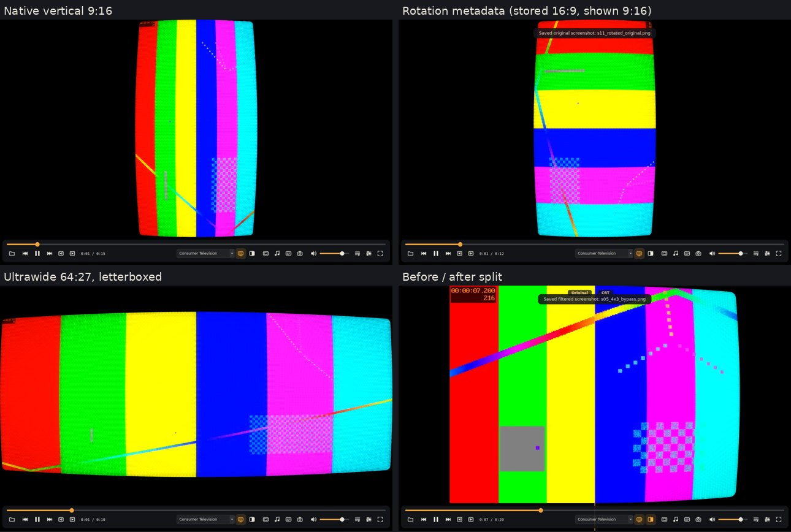

| Mode | Behaviour |
|---|---|
| **Original size** | 1 display pixel = 1 screen pixel. Shrinks, without distortion, if the picture is larger than the window. |
| **Fit** (default) | Whole picture visible, with bars where needed. |
| **Fill** | No bars. Edges are cropped symmetrically. |
| **Crop** | Per-edge crop sliders (0–45 %) plus a *Crop to aspect* list (4:3, 16:9, 1.85, 2.39, 21:9, 1:1, 4:5, 9:16). The cropped picture is then fitted. |

**Aspect override** (Display tab) is for files with wrong metadata only. It is the one
setting that deliberately stretches the picture, and it defaults to *From file*.

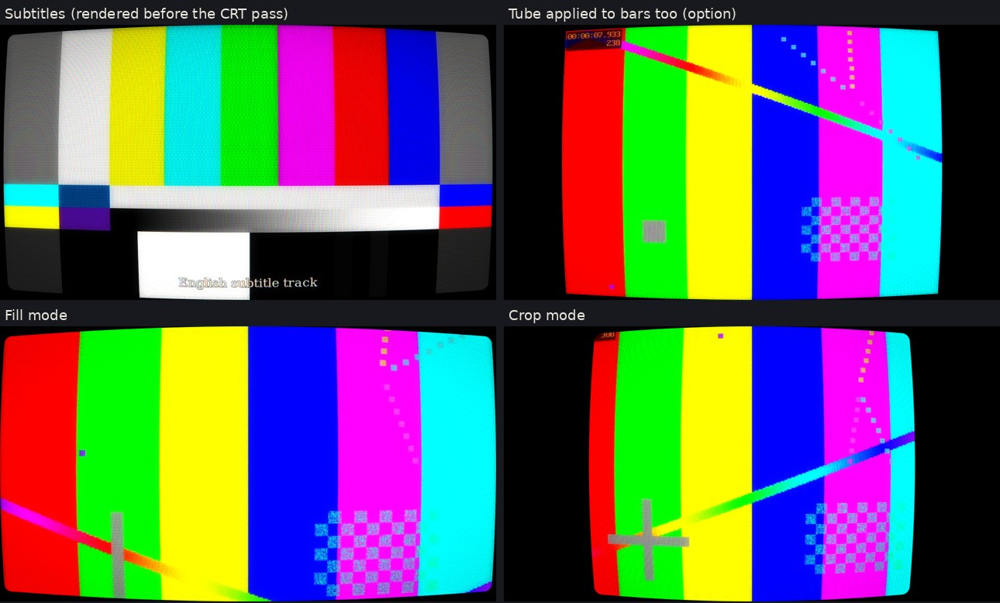

---

## CRT presets and parameters

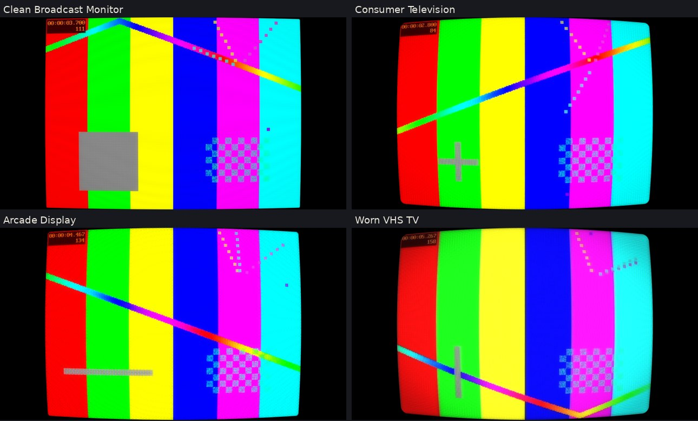

**Built-in presets** (read-only). Press `[` and `]` to cycle through them.

| Preset | Character |
|---|---|
| **Clean Broadcast Monitor** | Sharp scanlines, fine aperture grille, almost flat, no signal artefacts |
| **Consumer Television** | Soft scanlines, shadow mask, visible curvature, mild bleed, noise and flicker |
| **Arcade Display** | Dynamic 240-line scanlines, slot mask at 2×, strong bloom and saturation |
| **Worn VHS TV** | A tired tape on an old set: jitter, a rolling tracking band, heavy head switching, chroma delay, dropouts, soft and desaturated |
| **VHS Home Recording** | A decent SP recording: mild jitter, head switching at the bottom, chroma delay, tape softness |
| **LaserDisc Composite** | A clean disc over a composite cable: dot crawl on colour edges, rainbow on fine detail |
| **LaserDisc with Laser Rot** | The same, plus flickering laser-rot speckles and more noise |
| **Interlaced Broadcast Monitor** | Alternating-field scanlines on a flat studio monitor |
| **VGA Double-Scan Monitor** | Every line drawn with a thin gap, fine shadow mask |
| **Low-Res Console** | The picture rendered at 240 rows; each pixel drawn as a soft beam dot (pixel-beam style) |
| **Geom Look** | Geom-style beams, aperture grille, noticeable curvature |
| **Lottes Look** | Lottes-style soft pixels and beams, shadow mask, a touch of bloom |
| **Easymode Look** | Easymode-style thin dark lines that swell when bright, flat screen |
| **Hyllian Look** | Hyllian-style flat beams and crisp horizontals, flat screen |
| **MAME HLSL Look** | Sine-shaped scanlines, shadow mask, bloom, slight convergence error |
| **16-bit Console (256×224)** | Wide 256×224 pixels, sharp filter, geom-style beams, shadow mask |
| **Sega CD FMV** | Full-motion video as the console played it: 256×224, blocky codec, 64 dithered colours, 15 frames a second, composite into a TV, 8-bit sound. See [Sega CD FMV look](#sega-cd-fmv-look) |
| **Sega CD FMV (small window)** | The same with the video in a window with a black border, 12 frames a second, as the early games had it |
| **Home Computer (320×200)** | 320×200 hard pixels, sharp scanlines, fine shadow mask |
| **PAL Television** | Consumer set on a PAL signal: 50 Hz fields, diagonal colour crawl, Hanover bars |
| **Handheld (4 greens)** | 160×144 pixels in four greens, no scanlines, slow-LCD ghosting |
| **Sharp PC Monitor** | Light aperture grille, barely curved |

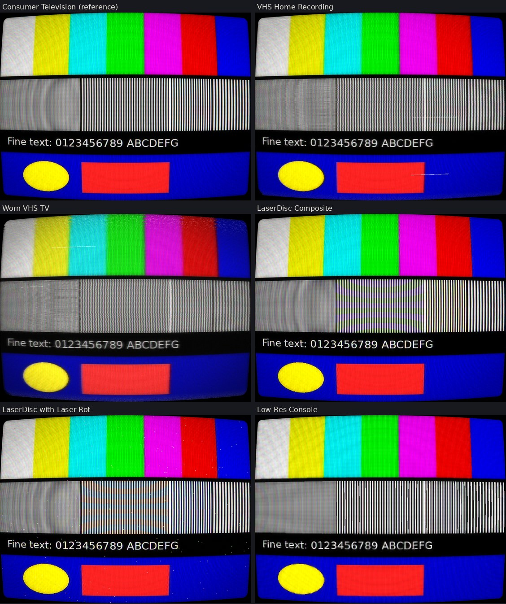

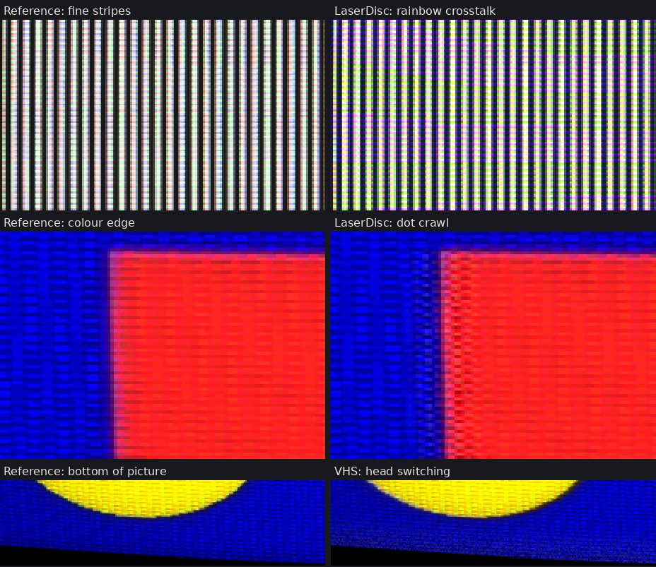

All built-in presets keep Overscan at 0, so no preset crops the picture unless you
raise it.

**Parameters** (*Picture → CRT* tab; every control has a tooltip):

| Group | Controls |
|---|---|
| Resolution | Rows, columns (Auto = square pixels), pixel filter, colours and dither, with quick picks |
| Scanlines | Style (11, see below), strength, beam width, line count (Auto, or a fixed number) |
| Set behaviour | Power on/off animation, static between items, VCR on-screen display |
| Phosphor mask | Pattern (none / aperture grille / shadow mask / slot mask), strength, scale |
| Geometry | Curvature, corner rounding, overscan, *apply the tube to black bars too* |
| Light | Bloom, phosphor glow |
| Signal | Chromatic aberration, colour bleed, noise, flicker |
| VHS tape | Timebase jitter, tracking error, head switching, chroma delay, dropouts, tape softness |
| Composite & LaserDisc | Dot crawl, rainbow crosstalk, laser rot |
| Picture | Vignette, brightness, contrast, saturation, colour temperature |

**Scanline styles**

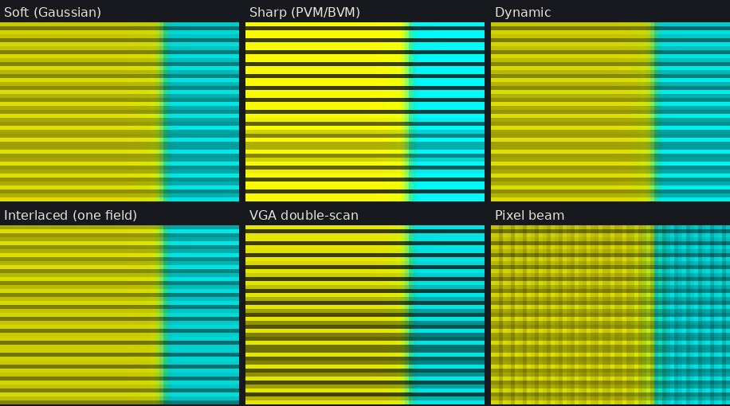

| Style | What it simulates |
|---|---|
| Soft (Gaussian beam) | A round beam with soft gaps; bright areas widen slightly. The classic look |
| Sharp (PVM/BVM) | A flat-topped beam with hard dark gaps, like a studio monitor |
| Dynamic | Thin lines in dark areas, fat lines that nearly close the gaps in bright ones |
| Interlaced | The line pattern moves half a line every field (59.94 Hz), giving interlace twitter while playing |
| VGA double-scan | Every line drawn with a thin gap, kept at least about one screen pixel wide |
| Pixel beam | The picture is sampled once per low-res pixel and each pixel drawn as a soft beam dot. Pair it with a fixed line count such as 240 |

### Deeper simulation

**Persistence** (*Light* group). Phosphors keep glowing briefly after the beam passes, so
bright moving objects leave a short trail. Red and green fade more slowly than blue, as
with real P22 phosphors. The decay is based on elapsed time, so it looks the same at any
frame rate. It's switched off while the before/after view is on, and screenshots never
include it.

**Colours and Dither** (*Resolution* group):

- **Colour depth:** 15-bit (32 768 colours), 12-bit, 9-bit (512), 8-bit (3-3-2),
  6-bit, or 3-bit (8 colours). Or a fixed palette: **Game Boy** (4 greens), **CGA**
  (black, cyan, magenta, white) or **EGA** (16 colours).
- **Dither:** ordered 4×4 or 8×8. It hides banding with a regular pattern, aligned to
  the picture's pixels, so with *bigger pixels* each block gets one dither cell.

**Standard** (*Signal* group): **NTSC** or **PAL**. PAL changes three things:

- the scale of the tape artefacts (576 lines);
- the field rate (50 Hz), which affects interlacing, colour crawl and noise;
- the composite pattern: PAL's diagonal crawl, and the **Hanover bars** (fine hue
  stripes that alternate line by line) when rainbow or dot crawl is on.

**Set behaviour** (its own group):

- **Power on/off animation:** the raster opens from a bright line when playback starts,
  and collapses to a line, then a dot, when the playlist ends. The screen stays dark
  until you play again.
- **Static between items:** switching playlist items shows static until the new file's
  first picture, then fades out.
- **VCR on-screen display:** PLAY ▶, PAUSE ❚❚, ◀◀ REW, ▶▶ FF and STOP ■ in the corner.
  It's inserted into the video *signal*, like a real VCR: steady while the tape picture
  wobbles, but it bleeds and gets scanlines on the TV.

Several presets use these: Consumer Television, the VHS presets, Arcade, the console and
computer presets, PAL Television and Handheld.

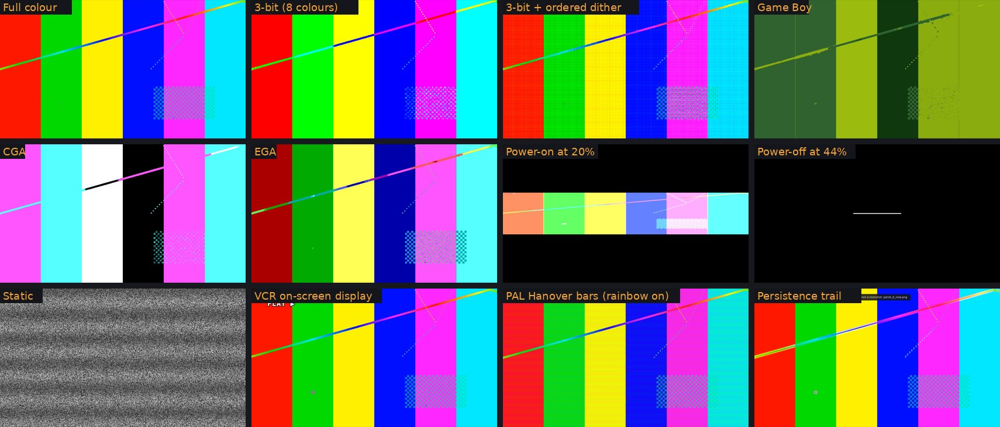

### Lower resolution (bigger pixels)

*CRT → Resolution* renders the picture at a lower resolution, so every pixel becomes a
visible block, the way a 240p console or a 320×200 computer looks on a TV.

- **Resolution:** a quick pick (240 lines, 224, 160, 256×224, 320×200, 160×144, …), or
  set **Rows** and **Columns** exactly.
  - Rows count down the picture; for portrait video, along its height.
  - Columns *Auto* keeps pixels square. A 16:9 video at 240 rows becomes 427×240, and an
    anamorphic DVD becomes 427×240 too.
  - A fixed column count gives wide or narrow pixels (256×224 is the classic 16-bit
    console shape). The picture's shape on screen never changes.
- **Pixel filter:**
  - **Hard:** pure blocks.
  - **Sharp:** blocks with a one-screen-pixel smoothed edge. This avoids uneven,
    shimmering blocks when a pixel isn't a whole number of screen pixels; it's the
    default.
  - **Soft:** smooth, like a blurry analog source.
- **Downsampling averages areas properly,** so fine detail blends into blocks rather
  than flickering.
- **Everything follows the lowered picture.** With *Line count: Auto*, scanlines lock to
  exactly one line per pixel row. Every scanline style, the VHS/LaserDisc effects and
  desk mode all see the lowered picture.
- **What stays at full resolution:** Bypass, the *original* side of the before/after
  view, and *original frame* screenshots.

In desk mode the blocks are drawn on the tilted 3D glass, so their edges soften
slightly with perspective. After flying into fullscreen they're exact.

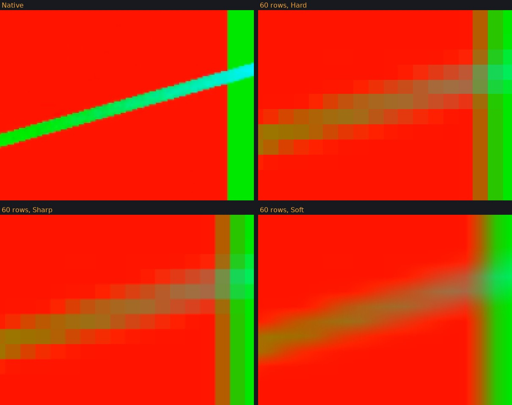

### Sega CD FMV look

Full-motion video as the Sega CD showed it: small, blocky, grainy with dither, a little
choppy, and unmistakable. Pick the preset **Sega CD FMV**, or **Sega CD FMV (small
window)** for the look of the early games, which played their video in a window with a
black border.

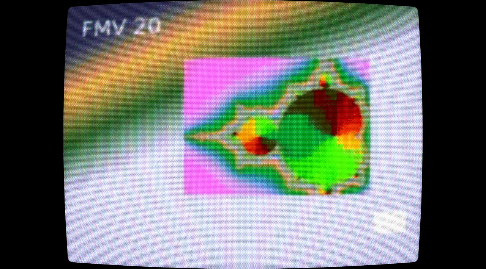

What the console did, and what the look does:

| The console | The look |
|---|---|
| A 256×224 screen with slightly wide pixels | The video is drawn on that grid (340×224 for 16:9 video, so nothing is stretched) |
| A video codec working in 4×4 blocks, redrawing only the blocks that changed | Blocks go flat or two-coloured; blocks where little moves stay frozen for a few frames |
| 64 colours on screen, out of 512 | A palette of up to 64 colours picked for the picture, all from the console's 512, with a checkered dither faking the rest. It is picked afresh at every full frame (every 2 seconds, and after a jump) and whenever the picture needs different colours; in between it stays, so still areas don't flicker |
| About 12 to 15 frames a second | The picture changes 15 times a second (12 in the small-window preset); the sound carries on normally |
| Composite video into a TV | Colour bleed, rainbowing and dot crawl, then scanlines and a slot mask |
| 8-bit PCM sound | **Console PCM**: fewer bits and a lower sample rate, unsmoothed, through the TV's speaker |

The controls are in *CRT → FMV console*:

- **Console:** Off, or Sega CD.
- **Colours:** 8 to 256 on screen at once (64 is the console's).
- **Frame rate:** the video's own, or 10 to 30 frames a second.
- **Codec blocks:** how hard the codec works. Higher flattens more blocks and freezes
  more of them where little moves.
- **Dither:** the strength of the checkered pattern.
- **Video window:** the video's share of the screen, down to half, with black around it.

*CRT → Sound → Console PCM* is the sound; it works with any look.

The console setting takes over the resolution (it is always the 224-row screen) and the
*Colour depth* setting. Everything after it still applies: any scanline style, mask,
curvature, VHS effects and desk mode. Bypass, the *original* side of the before/after
view and *original frame* screenshots stay untouched.

### Emulator scanline looks

The last five styles reproduce the *look* of shaders that many people know from
RetroArch and MAME.

- **Geom-, Lottes-, Easymode- and Hyllian-style** use *beam reconstruction*. The picture
  is read at scanline resolution; every screen pixel sums the light of the nearest
  scanlines; and each line's beam widens with its brightness, *per colour channel*, with
  the sum done in linear light. That's why bright lines swell into the gaps while dark
  lines stay thin.
- **MAME HLSL-style** is a sine-shaped scanline modulation with a brightness offset,
  so the gaps never go fully black.

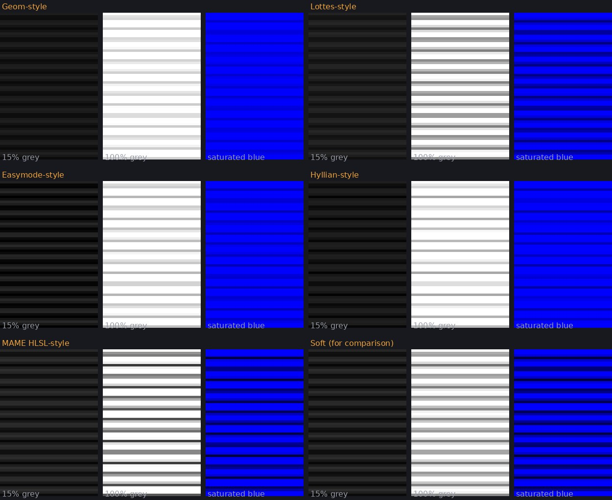

| Style | Look it's modelled on | What characterises it |
|---|---|---|
| Geom-style | RetroArch **crt-geom** | Beams rebuilt from the two nearest lines in linear light; widths grow with brightness; mild horizontal sharpening |
| Lottes-style | **crt-lottes** | Constant beam width over four lines, plus a Gaussian across neighbouring source pixels, giving soft round "pixels" |
| Easymode-style | **crt-easymode** | Very thin lines in dark areas that fatten strongly when bright; sharp horizontals |
| Hyllian-style | **crt-hyllian** | Flat-topped beams with hard gaps; strong horizontal sharpening |
| MAME HLSL-style | MAME's **HLSL / BGFX** post-processing | Sine-shaped lines with a brightness offset; the same structure at every brightness |

**These are not ports.** I wrote the implementations from scratch, using the published
general techniques: Gaussian beam reconstruction, brightness-dependent beam width,
Lanczos-style sharpening, linear-light blending and sine modulation. They were tuned by
eye and by measurement toward each shader's characteristic appearance. They were
**not** compared side by side with the originals, so expect a family resemblance, not
identical output. Credit for the looks goes to the authors of crt-geom (cgwg and
contributors), crt-lottes (Timothy Lottes), crt-easymode (EasyMode), crt-hyllian
(Hyllian) and to the MAME team.

**Tips:**

- The beam styles treat the video as a signal with as many lines as *Line count*. Auto
  gives about 240–270 lines, the classic look. Set 480 or more for a finer, less
  pixelated result on HD video.
- They look best with at least 4 screen pixels per line, for example a 240-line setting
  on a 1080p display.
- All VHS, composite and LaserDisc effects still apply. They pass through the beams like
  real signal content.

**VHS and composite effects** are measured against the *picture*, not the window:
480 NTSC lines down it and 640 samples across it. So a tracking band, head switching
at the bottom edge, or dot crawl looks the same on 4:3, 16:9, ultrawide and vertical
video, and never spills into letterbox bars. Everything except Tape softness and Chroma
delay animates while playing. The animation stops when you pause.

**Auto line count** uses the number of visible source lines. It halves that number
until each line spans at least 2.5 screen pixels, which prevents moiré. For example, a
480-line source becomes 240 lines at 720p; a 1080-line source becomes 270 lines in a
1080-pixel-tall window.

**Managing presets:**

- **Save as new…** saves the current settings as a new preset.
- **Save changes** overwrites the selected user preset.
- **Revert** discards unsaved changes.
- **Rename…** and **Delete** work on user presets only.
- **Import…** reads a preset file. If the name is already taken, it is renamed
  "Name (2)".
- **Export…** writes the settings as currently shown, including unsaved tweaks.

When the current settings differ from the selected preset, the panel shows
*Modified*.

**Preset file format.** User presets live in `~/.local/share/CRTPlayer/presets/`, one
JSON file each:

```json
{
  "format": "crtplayer-preset",
  "version": 1,
  "name": "My Trinitron",
  "params": {
    "scanStrength": 0.3, "scanWidth": 0.55, "scanLines": 0,
    "maskType": 1, "maskStrength": 0.2, "maskScale": 1,
    "curvature": 0.04, "cornerRadius": 0.02, "overscan": 0, "includeBars": false,
    "bloom": 0.1, "glow": 0.1, "chroma": 0, "bleed": 0, "noise": 0, "flicker": 0,
    "vignette": 0.1, "brightness": 1.05, "contrast": 1.05, "saturation": 1, "warmth": 0
  }
}
```

Missing keys take defaults, and out-of-range values are clamped. The 1.1 keys are
`scanType` (0–5), `vhsJitter`, `vhsTracking`, `vhsHeadSwitch`, `vhsChromaDelay`,
`vhsDropouts`, `vhsSoftness`, `dotCrawl`, `rainbow` and `laserRot`. Presets from 1.0
load unchanged, with all of these off. `scanType` 6–10 are the emulator looks (1.3). `pixelHeight` (0 = native),
`pixelWidth` (0 = square pixels) and `pixelFilter` (0 hard, 1 sharp, 2 soft) set the
lowered resolution (1.4). New in 1.7: `persistence`, `colorDepth`, `dither`,
`videoStandard`, `powerEffects`, `channelStatic` and `vcrOsd`.

---

## Screenshots, frame stepping, playlist

**Screenshots** use the camera button, S, Shift+S or Ctrl+S. There are two kinds:

- **Filtered:** exactly what the video area shows, at its current pixel size, with
  effects and bars.
- **Original:** the decoded frame with no effects. It is PAR-corrected and rotated, at
  native size, for example 853×480 for an anamorphic DVD frame.

Files go to `~/Pictures/CRT Player/` as `<video>_<hh-mm-ss.mmm>_<crt|original>.png`.
You can change the folder and the default type in *Picture → Playback*.

**Frame stepping** with `.` and `,` pauses first and moves exactly one frame. The
backward step seeks accurately to the previous frame's interval, so it lands correctly
even after GStreamer clips timestamps.

**Playlist** (L):

- Add files with the + button, drag-and-drop, or the Open dialog.
- Reorder by dragging.
- Double-click an item to play it.
- Playback advances automatically at the end of each file.
- The playlist is saved between sessions.

---

## Cutting without re-encoding, and GIF clips

Both work on the **A–B section**. Press **R** at the start, then **R** at the end (or use
the buttons in the dialogs). Both are also on the screenshot button's menu.

**Cutting (X).** This saves A–B as a new file. The video, sound and subtitles are copied
as they are, like Avidemux's *copy* mode: nothing is re-encoded, so there's no loss and
it takes seconds.

- **Where it starts:** a copied video can only begin on a **keyframe**, a frame that
  decodes on its own (I-frames, strictly IDR/sync frames). The cut starts at the
  keyframe at or before A; the dialog says where before you save.
- **Choosing A:** **Shift+←** and **Shift+→** jump between keyframes, so A can sit
  exactly on one.
- **Where it ends:** at B, frame-accurately. Every frame up to B is kept, plus at most a
  couple of B-frames needed to show them.
- **What it keeps:** every track the container can hold: all audio tracks, all subtitle
  tracks, chapters aside.
- **The file type:** the same as the original (MP4, MKV, WebM, MOV, TS, AVI, OGG…).
  Matroska is used when GStreamer can't write the original's type.
- **The original is never changed or overwritten.** The cut is a new file next to it:
  *Movie - cut 00-01-02 to 00-01-45.mkv*, with *(2)*, *(3)*… if that name is taken.
  - It's written under a hidden temporary name and renamed only when complete, so a
    stopped or failed cut leaves nothing behind.
  - If the video's folder is read-only, the cut goes to your *Videos* folder.
- **Only files on this computer** can be cut, not Jellyfin or network streams.
- **A subtitle already on screen at the keyframe is left out.** Subtitle lines are
  stored at the moment they appear, so one that started before the cut isn't carried
  over. Lines that start inside the section are kept, and end at B.

**GIF clips (G).** This saves A–B (or the next 5 seconds when A and B aren't set) as a
looping animated GIF, just as it looks. It is saved in the screenshot folder.

| Option | Choices |
|---|---|
| Size | 320 to 1024 pixels wide (480 is a good start), HD 720p, Full HD 1080p, 1440p, or 4K |
| Smoothness | 10 to 30 frames a second |
| Picture | With the CRT look, or the original picture |

- **Every frame is drawn at the GIF's own size,** so a 4K GIF is real 4K: the tube has
  room for every scanline and the mask is fine-grained, not an enlargement of the
  window. The HD sizes fit the picture inside the named frame: a 16:9 video at 4K is
  3840×2160, a 4:3 video 2880×2160.
- **The frame rate is exact on any computer.** The player steps through the section
  frame by frame while paused and draws each one, so a slow computer only takes longer.
  The picture on screen holds still meanwhile, and the dialog shows the progress. When
  it finishes, the player is back where it was.
- **Desk mode** records the whole scene: the TV and the room around it.
- **Colours:** each frame gets its own 256-colour palette, with dithering.
- **Big GIFs are big files.** With the look, a 4K GIF runs to 1 to 3 MB per frame: a
  5-second clip at 15 frames a second came to 250 MB here. The dialog shows the size as
  it grows. For anything long, a smaller size is kinder.
- **Length:** at most 30 seconds (GIFs get big).

---

## Everyday playback

**Resume.** Local files continue where you left them; the message says so, and **Home**
starts over.

- The position is saved when you switch files, every 15 s while playing, and on quit.
- Positions in the first or last 30 seconds aren't kept, and playing to the end clears
  the entry.
- Positions for the 300 most recently used files live in
  `~/.local/share/CRTPlayer/resume.json`.
- Jellyfin videos resume from the server's own position instead.

**Recent files.** Click the small arrow on the **Open** button, or in desk mode
right-click → *Recent files*. Each entry shows where you'd resume.

**Subtitles are off until you ask for them, and then they stay as you set them.**
Press **V** (or pick a track from the subtitle button's menu) and subtitles are on for
this video, the next one, every TV channel, and the next time the player starts. Turn
them off and they stay off the same way.

- **The language carries over too.** Pick English subtitles once and the English track
  is chosen in every video that has one, wherever it is in the file. The same goes for
  the sound: pick the Japanese track and videos with Japanese sound play it. A video
  without that language plays its own first track.
- **Picking by hand always wins** for the video you are watching.
- **Turning subtitles on in the middle of a line** shows the line straight away.

**After a jump, the right line is on screen at once** (2.16). Skip forwards or back, drag
the seek bar, jump while paused, change the speed, loop a section: the picture you land on
carries the subtitle line that belongs to it, also when that line began before the place
you jumped to. This holds for subtitles inside the video (Matroska, MP4), for subtitle
files, and for Jellyfin.

- **How:** a video file hands out each subtitle line once, at the moment it begins, so
  the playback library (GStreamer) used to have nothing to show after a jump until the
  next line began. The player now reads the subtitle lines itself, keeps them, and gives
  the right ones to the drawing after every jump. The first picture after a jump waits
  for its lines: a few thousandths of a second, a quarter of a second at the very most.
- **Picture subtitles** (DVD, Blu-ray) are still drawn by GStreamer, as before: after a
  jump they return with the next line. The first time a picture-subtitle track is shown
  in a video, the video is opened again where it stands (a short pause).
- **A line that has been on screen for more than a minute** at the place you jump to (a
  sign that stays up for minutes) returns with the next line, when the subtitles are
  inside the video. A subtitle file is known as a whole, so there it is shown.
- **Moving and fading ASS lines** begin their movement at the place you jumped to.

**Subtitle files.** Subtitle files next to the video are loaded automatically:
`Movie.srt` first, then others such as `Movie.en.srt`. They show when subtitles are on.
The subtitle button's menu lists them, along with *Load subtitle file…* and *No subtitle
file*; picking one turns subtitles on.

- **Picking a file takes effect at once** (2.16): the video plays on, it is not opened
  again.
- For Jellyfin videos, the server's external subtitle files appear in the same menu.
  When subtitles are on and the video has none of its own, the server's file in your
  language (or its first) is loaded by itself.
- Subtitles are drawn into the picture, so they get the CRT look (and appear in desk
  mode).
- SRT, ASS/SSA, WebVTT and SUB are supported. ASS/SSA files keep their styles
  (GStreamer cannot read these as files; since 2.16 the player reads them itself. Before,
  an `.ass` file next to a video, or one from a Jellyfin server, showed nothing).
- Short SRT files are handled too. GStreamer can't recognise very short SRT files on its
  own, so the player plays subtitles from a padded local copy.

**How subtitles look** (*Settings → Playback → Subtitles*):

| Setting | Choices |
|---|---|
| Size | Small, Normal, Large, Very large |
| Colour | White, Yellow |
| Behind the text | Outline, or a dark box |
| Position | Bottom, Raised (clear of a curved tube's edge or a cropped picture), Top |

These apply to text subtitles. Picture subtitles (DVD, Blu-ray) are drawn as the disc
made them.

**Subtitles out of step?** **H** shows them 0.1 s later, **Shift+H** earlier (or type a
value under *Subtitles → Delay*). The new timing holds at once (a quarter of a second
after the last key press). It belongs to the video you are watching: the next one starts
without it.

**Sound out of step with the lips?** **Ctrl+=** plays the sound 50 ms later, **Ctrl+−**
earlier (or *Sound → Sound delay*). This one is remembered, because the usual cause is
the equipment: a wireless speaker or a TV that adds its own delay.

**Night mode (D).** Quiet speech comes up and loud bangs come down, so a film can be
followed at low volume without riding the volume control. It works with any look, on
top of the look's own sound, and never clips.

**Deinterlacing.** DVDs and TV recordings are often interlaced: each frame holds two
half-pictures taken a moment apart, which shows as combing on anything that moves. Such
video is deinterlaced automatically; other video is never touched. *Settings → Playback
→ Deinterlace interlaced video* turns it off if you want the frames as stored (the
*Interlaced* scanline style is a look, and works either way).

**Shuffle and repeat.** The playlist panel has both (also **Ctrl+H** and **Ctrl+R**, and
in desk mode right-click → *Playlist*).

- **Shuffle** plays every video once in a random order; *previous* walks back through
  what was played.
- **Repeat** is off, the whole playlist, or this video.
- With both, a new random round starts when one is finished.

**Playlist files.** The playlist saves as an `.m3u8` file (the disk button in the
playlist panel). Open one like a video, or drop it on the window, and its videos are
added. `.m3u` and `.m3u8` files from other players work too. Videos in the list's own
folder are written relative to it, so the folder can be moved or copied.

**The next video in the folder.** With *Settings → Playback → Carry on with the next
video in the folder* on, a video that ends with nothing after it in the playlist is
followed by the next one in its folder, in name order with numbers read as numbers
(Episode 2 before Episode 10). It is off by default.

**Sleep timer (Shift+Z).** Stops playing after 15 to 120 minutes, or at the end of the
current video. The sound fades out over the last seconds, playback pauses (in TV mode
the TV turns off), and the screen is free to dim and sleep again. A message comes up a
minute before. It is also under *Settings → Playback* and, in desk mode, right-click →
*Sleep timer*.

**Speed.** **−** and **+** change the speed in 0.25× steps (0.25× to 4×), and
**Backspace** returns to normal. Voices keep their natural pitch.

**A–B loop.** Press **R** at the start of the part to repeat, then **R** again at its
end. The range shows on the seek bar, and a third **R** turns it off.

**Chapters.** For files with chapters (e.g. MKV), **Shift+PgDn** / **Shift+PgUp** jump
between them. The seek bar shows a tick at each chapter, and hovering shows the chapter
name.

**Seek-bar previews.** Hovering over the seek bar shows a small frame from that point,
for local files. Previews use the nearest keyframe (fast, and they never disturb
playback), so they can be a few seconds off in files with sparse keyframes. Jellyfin
streams show the time and chapter only.

**Keeping the screen awake.** While a video plays, the player asks the desktop not to
dim, lock or sleep. It's released as soon as you pause or stop, so the normal power
settings apply again.

- **KDE:** it uses `org.freedesktop.ScreenSaver` and PowerManagement.
- **GNOME and others:** it uses the desktop portal.
- **To turn it off:** *Settings → Playback → Keep the screen awake while playing*.

**System report.** *Settings → Playback → Copy system report* puts a summary on the
clipboard for bug reports. It covers:

- the OS, session, desktop and whether it's gamescope;
- the Qt version, GPU/OpenGL and screens;
- the GStreamer version, available hardware decoders and missing plugins;
- the current video's format and decoder;
- the look, desk mode, and whether you're signed in to Jellyfin.

It contains no file names, paths, user names or server addresses.

---

## Without a graphics card

The CRT effects are made for a graphics card. Some machines have none that the player
can use:

- a **virtual machine** without 3D acceleration, for example QEMU / virt-manager with
  the Virtio video model and *3D acceleration* off (the usual setup when the host has an
  NVIDIA card);
- a remote desktop session, or a machine whose graphics driver is not installed.

There, OpenGL runs in software on the CPU (Mesa's *llvmpipe*), and every pixel the
player draws is computed one by one. Before 2.12 that made even plain playback slow: a
1080p video with effects off took 91 ms a frame on the test machine, most of it turning
the video's colours into screen colours at the video's full size.

From 2.12 the player notices software OpenGL by itself and works differently. **Nothing
needs to be set.** Press **I** to see which way it is drawing: the *Drawing* line says
*no graphics acceleration (software OpenGL)* and what is done on the CPU.

**With effects off** (press **B**):

- The video pipeline converts the colours and scales the picture **on all CPU cores**,
  in the video's own threads, with the CPU's vector instructions.
- Frames arrive at **exactly the size they are shown at**, so a 4K video in a 1080p
  window costs no more to draw than a 1080p one.
- The picture is **painted straight into the window. OpenGL is not used at all.**

**With a look:**

- Colours are converted on the CPU cores; only the look itself goes through software
  OpenGL.
- A video much larger than its picture (4K in a 1080p window) is scaled down first.
- In a large window (more than 800 pixels high) the look is **drawn at half size and
  enlarged**: a quarter of the pixels to compute. It is a little softer.
  *Settings → Playback → Decoding → Look detail* chooses **Automatic**, **Full size** or
  **Half size**.

**Desk mode** gets its frames converted on the CPU cores too. The 3D scene itself is
still drawn by software OpenGL, so it stays slow without a graphics card.

**What still goes the old way** (and is as slow as before): a rotated phone video, the
before/after split view, and recording a GIF. *Original frame* screenshots are always
taken from the full video frame, whichever way is in use: the player keeps the last few
decoded frames at hand for that.

**Measured** on the test machine (2 CPU cores, software OpenGL, a 1920×1080 screen;
video at 30 frames a second, fullscreen unless said):

| | 2.11 | 2.12 |
|---|---|---|
| 1080p H.264, effects off | 11 frames a second | **30** (full rate) |
| 4K H.264, effects off | 3.2 | **30** (full rate) |
| 4K HEVC 10-bit, effects off | 2.7 | 9.3 |
| 1080p, Clean Broadcast Monitor look | 7.5 | 24 (the look at half size) |
| 1080p, Consumer Television look | 2.9 | 12.8 (the look at half size) |
| 1080p in a window, effects off: CPU used | 1.8 of 2 cores (at 17 frames a second) | 0.45 of 2 cores (at 30) |

With effects off, playback is now limited by decoding and converting the video, as it
should be, and both use every core. On those 2 cores that is plenty for 4K H.264.

### 4K HEVC 10-bit (2.17)

4K HEVC 10-bit (most 4K films and series, and YouTube's 4K) was the one kind of video the
fast path could not keep up with: 9 frames a second at best. Two things changed in 2.17.

- **10 bits to 8, and smaller, in one pass.** The player brings 10-bit (and 12-bit)
  pictures to 8 bits and shrinks them by a whole factor (4K to 1280×720 for a 1080p
  window) in a single pass of its own, with a fine ordered dither so that gradients do
  not band, before GStreamer's scaler and converter see them. That takes 1.7 ms a picture
  instead of most of the conversion's time. 8-bit videos are left as they were (no gain
  was measured there).
- **Pictures left out before they are decoded.** When the computer still cannot decode
  every picture in time, GStreamer used to drop pictures *after* decoding them, wasting
  the work. The player now leaves out, before decoding, pictures that no other picture
  is built from (H.264 and H.265 mark them), just as many as it takes for the rest to
  arrive on time. A computer that keeps up loses nothing; paused and frame-stepped
  pictures are always the exact ones.

Measured on the same 2 cores, fullscreen, effects off:

| | 2.16 | 2.17 |
|---|---|---|
| 4K HEVC 10-bit, a light clip | 10 frames a second | **30** (full rate) |
| 4K HEVC 10-bit, a hard clip (20 Mbit/s, film grain) | 4 to 6 | **23 to 24**, all of them on time |

Decoding alone manages 31 frames a second of the hard clip on these 2 cores, so that is
close to what the machine can do. With a look on, drawing the look is the limit, as before.

Both work only without a graphics card (a graphics card converts the picture itself).
`CRTPLAYER_SHRINK_OFF=1` and `CRTPLAYER_GOVERNOR_OFF=1` switch them off, for comparison.

**Settings** (*Settings → Playback → Decoding*):

- **CPU fast path:** *Automatic* (used only without a graphics card), *Always*, or
  *Never* (everything as before 2.12).
- **Look detail:** *Automatic*, *Full size*, *Half size* (see above; it only applies
  without a graphics card).

**Getting the most out of a virtual machine:**

- **Give the guest more CPU cores.** Decoding, colour conversion, scaling and software
  OpenGL all use every core they are given.
- **Pass the host's CPU through** (*Copy host CPU configuration* in virt-manager). The
  fast code paths use the CPU's vector instructions (AVX2), which a generic virtual CPU
  hides.
- **Effects off is by far the cheapest.** With a look, a smaller window or *Look detail:
  Half size* helps most; the lighter looks (Clean Broadcast Monitor) cost less than the
  heavy ones (Consumer Television, VHS).
- If the virtual machine can be given real 3D acceleration, the player uses it by
  itself and none of this applies.

**Good to know:**

- The CPU's colour conversion and the graphics card's agree to within about 3 steps of
  255 per colour, and the edge of a coloured area can sit up to a pixel differently.
  Brightness edges are in exactly the same place.
- For tests: `CRTPLAYER_VIDEO_SURFACE=raster` or `gl` picks the window surface
  (normally *raster* without a graphics card, *gl* with one), and
  `CRTPLAYER_FAST_PATH=auto|always|never` and `CRTPLAYER_LOOK_DETAIL=auto|full|half` set
  the two settings' defaults.

## Enhance: sharper upscaling and smooth motion

Two optional enhancements for a system with a graphics card, both off until you turn
them on in *Settings → Playback → Enhance*.

Each can be done in two ways:

- **Built in:** ordinary shaders, in the manner of the upscalers and motion interpolation
  that games and TVs use. They are not AI models, need nothing installed, and run on any
  graphics card that runs the player.
- **NVIDIA AI** (2.15, for NVIDIA RTX cards): NVIDIA's Video Super Resolution and Video
  Frame Generation, which are AI models and do both jobs clearly better. They come with
  NVIDIA's Video Effects SDK, which you install yourself; see
  [NVIDIA AI](#nvidia-ai-upscaling-and-frame-generation-rtx-cards) below.

Neither is NVIDIA's DLSS, which works only inside games (it needs motion and depth
information from the game).

### Sharper upscaling

When a video is shown larger than it is (a DVD or a 720p video on a big screen), the
player normally stretches it smoothly, which looks soft. With **Sharper upscaling** on:

1. The picture is rebuilt at the size it is shown at with a sharper filter (a 16-tap
   Lanczos reconstruction whose overshoot is held back, so edges get no halos).
2. It is then sharpened where the picture has room for it (contrast-adaptive
   sharpening: flat areas and noise are left alone, strong edges are not overdone).

**Sharpness** sets how strong step 2 is. At 0 the picture is only rebuilt.

- **When it applies:** with effects off (**B**), and only when the picture is shown at
  least 15% larger than the video. A CRT look decides the picture's sharpness itself and
  is left alone.
- **What it does not do:** invent detail. It keeps the detail the video has crisp where
  plain stretching smears it.
- *Original frame* screenshots are the video's own frame, untouched.

Measured on a detailed test picture, a 960×540 video shown at 1920×1080 against the
1920×1080 original:

| | Plain | Sharper upscaling |
|---|---|---|
| Fine detail, as a share of the original's | 62% | 97% |
| Closeness to the original (brightness, PSNR) | 29.2 dB | 29.7 dB |

### Smooth motion (frame generation)

Films have 24 pictures a second and most video 25 or 30; the screen shows 60 or more.
With **Smooth motion** on, the player generates the pictures in between:

1. For every two frames that follow each other it works out how each part of the picture
   moves from one to the next (coarse to fine, on small copies of the two frames, in both
   directions).
2. For every refresh of the screen it draws the picture at that exact moment: each pixel
   is fetched from the frame before and the frame after along its motion, and the two
   are mixed.
3. Where the motion cannot be followed (something uncovered by a moving object, motion
   too fast or too fine) nothing is invented: the nearer real frame is shown there. The
   same for the whole picture across a cut.

- **It works with every look:** the generated picture goes through the CRT look like any
  frame.
- **The picture runs one frame behind** (a frame can only be shown once the next has
  arrived); the sound is held back by the same amount, so the two stay together.
- **Paused, you see the real frame.** Screenshots and GIFs are made from real frames.
- **Nothing is generated** when the video already has as many frames a second as the
  screen shows, or in desk mode.

Measured on a test scene (a panning background, three objects moving their own ways, a
title standing still): the frame generated halfway between two frames of the 30 frames a
second version, against the true frame from the 60 frames a second version:

| | Closeness to the true in-between frame (PSNR) | Pixels clearly wrong |
|---|---|---|
| Generated frame | 33.1 dB | 0.4% |
| A plain mix of the two frames (ghosting) | 22.7 dB | 7.0% |
| The frame before, repeated | 20.3 dB | |

**What to expect, honestly:**

- This is the "smooth motion" of a TV, not a film projector: some people love it, some
  call it the soap-opera effect. It is a matter of taste, which is why it is off by
  default.
- Faint halos can appear around something that moves against a moving background, and
  fine repeating patterns (railings, brickwork) can shimmer. Very fast motion (more than
  about a tenth of the picture's width per frame) is not followed and shows the real
  frames.
- Generated frames are a little softer than real ones.
- **Speed on a real graphics card was not measured:** it was built and checked on a
  machine without one. The motion search has a fixed cost (it always works 480 pixels
  wide); drawing the in-between picture costs one pass at the video's size for every
  refresh of the screen. If playback stutters with it on, it is too much for the card:
  turn it off.

### NVIDIA AI upscaling and frame generation (RTX cards)

With an NVIDIA RTX graphics card you can have the two enhancements done by NVIDIA's AI
models:

- **Video Super Resolution** in place of the built-in upscaler. It rebuilds detail
  rather than only keeping edges crisp, and cleans up compression damage on the way.
- **Video Frame Generation** in place of the built-in smooth motion. It follows motion
  that the built-in search loses (fast, fine, or partly hidden), so far fewer places
  fall back to a real frame.

Measured on an RTX 4090 with a test scene whose true pictures are known: upscaling
1080p to 4K came 4.8 dB closer to the true 4K picture than a plain enlargement, in
5 ms a picture; a generated in-between frame came 4 to 7 dB closer to the true one than
a mix of its two neighbours, in 2 ms at 1080p and 6 ms at 4K.

**What you need**

- An NVIDIA RTX graphics card with NVIDIA's own driver. NVIDIA names the RTX 20 series
  and newer, and driver 570.26 or newer, for the SDK. On Bazzite the driver comes with the
  `bazzite-nvidia` images.
- NVIDIA's Video Effects SDK 1.3 with two of its features: Video Super Resolution and
  Video Frame Generation. It is free, but it is NVIDIA's software under NVIDIA's licence,
  it is not part of the player, and NVIDIA hands it out only to signed-in members of its
  developer programme (also free). About 4.5 GB on disk.

**Installing the SDK on Bazzite**

NVIDIA's installer expects Ubuntu, so it is run once inside a small Ubuntu box, and the
result is copied out. After that the box is not needed again.

1. Make a free account at <https://developer.nvidia.com> and sign in at
   <https://catalog.ngc.nvidia.com>.
2. Search there for **Maxine VFX SDK**, open **VFX SDK Core**, and download the version
   named `1.3.0.0_linux`. You get `VFXSDK_linux_1.3.0.0.tgz` (2.6 GB); leave it in
   `~/Downloads`.
3. Make an API key: your account menu (top right) → **Setup** → **Generate API Key**
   (NVIDIA's NGC User Guide shows it under "Generating a Personal API Key"). The key
   starts with `nvapi-`. It is a password: keep it to yourself.
4. In a terminal, make the box and go into it:

   ```bash
   distrobox create --name vfx --image ubuntu:24.04 --nvidia --yes
   distrobox enter vfx
   ```

5. Inside the box (one line at a time; put your key in place of `PASTE-YOUR-KEY`):

   ```bash
   sudo apt-get update && sudo apt-get install -y curl xz-utils
   sudo tar -xf ~/Downloads/VFXSDK_linux_1.3.0.0.tgz -C /usr/local
   cd /usr/local/VideoFX/features
   export NGC_CLI_API_KEY=PASTE-YOUR-KEY
   sudo --preserve-env=NGC_CLI_API_KEY ./install_feature.sh -f nvvfxvideosuperres,nvvfxvideoframegeneration
   mkdir -p ~/.local/share/crtplayer
   cp -a /usr/local/VideoFX ~/.local/share/crtplayer/
   exit
   ```

6. Start the player. *Settings → Playback → Enhance* now says
   *NVIDIA AI: ready (upscaling and smooth motion)*.

The box and the download can be deleted afterwards (`distrobox rm --force vfx`). On Ubuntu,
Debian, Rocky or RHEL, NVIDIA's own instructions apply as they are; the player looks for
the SDK in `~/.local/share/crtplayer/VideoFX`, `~/.local/share/VideoFX`, `~/VideoFX`,
`/usr/local/VideoFX` and `/opt/VideoFX`, or wherever `CRTPLAYER_NVFX_SDK` points.

**Using it**

*Use NVIDIA AI for both* (on by default) only chooses the method. **Sharper upscaling**
and **Smooth motion** above it still turn the two enhancements on and off, and
everything said about them above still holds: upscaling applies with effects off when
the picture is shown larger than the video, smooth motion works with every look and
runs the picture one frame behind.

- **AI upscaling: Low, Medium, High, Ultra.** How much work is done on each picture.
  High is the default; in the measurement above it was as close to the true picture as
  Ultra, and quicker.
- **AI motion: Fast, Balanced, Best.** NVIDIA's three frame generation models. Best takes
  several times longer for each picture: on a 4K screen at 120 Hz it may not keep up.
- The line below says what is going on, for example *NVIDIA AI at work: upscaling
  1920×1080 to 3840×2160 (high), smooth motion (balanced). 6.4 ms a picture, 3.1 ms a
  frame of the video. 120 pictures a second on a 120 Hz screen.* The time for a picture has to
  fit between two refreshes of the screen (8.3 ms at 120 Hz, 16.7 ms at 60 Hz). If
  the pictures a second stay well below the screen's rate, choose a lower setting.
- With both on and effects off, the frame is upscaled first and frames are generated at
  the larger size. With a look, frames are generated at the video's size and the look is
  drawn from them.
- Video Super Resolution enlarges by the same factor in both directions, up to four
  times; a DVD's non-square pixels are stretched the rest of the way as before.

**When it cannot be used**

Whenever NVIDIA's method has no picture to give, that draw is done by the built-in
method, so the video never stops for it. The line in the panel says why: the SDK is not
installed, an effect could not be loaded, the helper stopped. A failure is tried again
a few times and then left alone until the next video or until you change a setting.

The work is done by a helper program, `crtplayer-nvfx`, that the player starts when the
first picture needs it and that holds NVIDIA's libraries, so that a fault in them
cannot take the player down. It is inside the AppImage, and beside the plain binary.
What it and NVIDIA's libraries print goes to `~/.cache/CRTPlayer/CRTPlayer/nvfx.log`.
On its own it can measure your card:

```bash
./crtplayer-nvfx --probe          # both effects at several sizes and settings: time per picture, and pictures to look at
```

This part was written, measured and first used on Bazzite with an RTX 4090 (driver 615),
on a 4K screen at 120 Hz. The checks that run without an NVIDIA card use a stand-in for
the SDK (see [VERIFICATION.md](VERIFICATION.md)).

### Good to know

- Press **I**: the *Enhance* line says what is on and what it is doing.
- **Without a graphics card** (software OpenGL) both are unavailable and greyed out;
  the CPU fast path is used instead (see [Without a graphics card](#without-a-graphics-card)).
- With either on, frames are taken as decoded: the *CPU fast path: Always* setting has
  no effect then.
- `CRTPLAYER_NVFX_OFF=1` in the environment keeps NVIDIA's methods out altogether.

## Controllers, media keys and Steam Game Mode

**Game controllers.** Any controller SDL2 knows works: Xbox, PlayStation, Switch Pro,
the Steam Deck, and Steam Input's virtual pad.

| Button | Action |
|---|---|
| A | Play / pause |
| B | Back: fly out of fullscreen, leave fullscreen, close a panel |
| X | Next subtitle track |
| Y | Fly in / out (desk mode), or fullscreen |
| View (Select / Back) | Desk mode on / off |
| Menu (Start) | Show the controls (desk mode: next scene) |
| LB / RB | Previous / next CRT preset |
| LT / RT | Previous / next playlist item |
| D-pad ← / → | Seek −10 s / +10 s (hold to keep seeking) |
| D-pad ↑ / ↓ | Volume |
| L3 / R3 (stick press) | Previous / next chapter |
| Left stick | Desk mode: turn the set |
| Right stick (up/down) | Desk mode: bigger / smaller |

**How it behaves:**

- **Menus and panels:** when one has focus (e.g. the Jellyfin browser), the D-pad, **A**
  and **B** work as arrow keys, Enter and Escape.
- **Focus:** the controller only acts while CRT Player is the active app, so it won't
  interfere with a game you're playing (in Game Mode it always acts).
- **SDL2 is optional:** it's loaded when the player starts (Bazzite includes it). If it's
  missing, controller support is simply off.

**Media keys, KDE's media widget and KDE Connect.** The player registers on D-Bus as a
media player (MPRIS, `org.mpris.MediaPlayer2.crtplayer`). The following all control it:

- your keyboard's play/pause/next keys;
- the Plasma media widget and lock screen;
- KDE Connect on your phone;
- `playerctl`.

It shares the title and length. For network streams (Jellyfin) no address is shared.

**Steam Game Mode.** Add CRT Player as a non-Steam game (the AppImage works) and launch
it from Game Mode:

- It starts fullscreen and takes controller input.
- Game Mode can't show a desktop through a window, so desk mode uses the **desk scene**
  (see [Scenes](#scenes)).

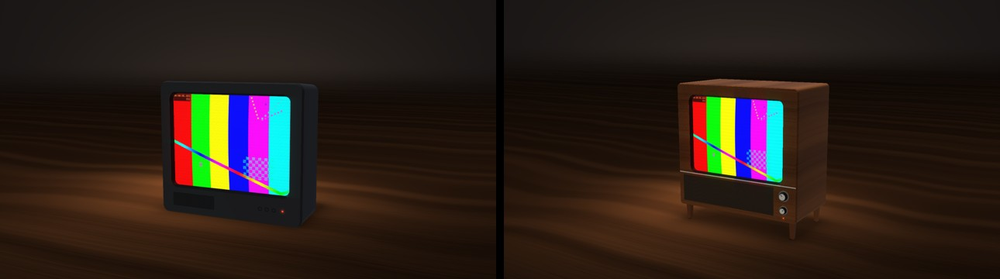

---

## Desk mode: a 3D TV on your desktop

Press **T**, or choose *Open the regular player window* from the desk menu to go back.
The regular window hides, and the video appears on a 90s-style CRT television that
stands on your desktop. There is no window frame: everything around the set is
transparent, and clicks beside it go to whatever is behind.

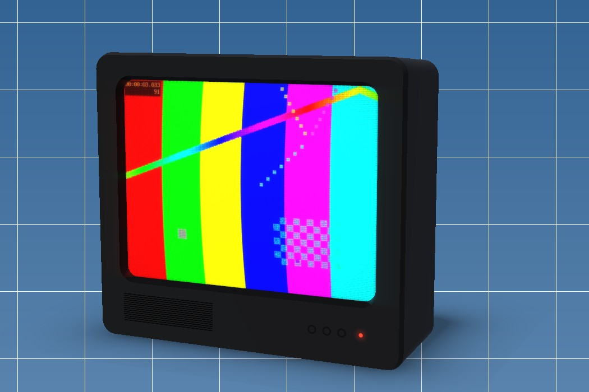

| On the set | Action |
|---|---|
| Drag | Turn it (with a little inertia when you flick) |
| Shift+drag, Alt+drag or middle-drag | Move it around the screen |
| Scroll | Make it bigger or smaller |
| Double-click, or F | Fly into fullscreen |
| Double-click or Esc (in fullscreen) | Fly back out to the desk |
| Right-click | Menu: fly in/out, open files, playlist, recent files, Jellyfin continue watching, CRT preset, set, scene (and its mood, fog, wood, quality), screen shape, keep on top, reset position, back to the regular window |
| Hover | Control strip under the set (hides after 2.5 s) |

**Flying in.** The set turns to face you and comes forward while the desktop dims,
until the glass fills the screen. The flight then dissolves into the normal fullscreen
player image, which is *pixel-identical* to the regular fullscreen view (it's measured
in the tests). Flying out reverses this, and the set returns to exactly where it was.

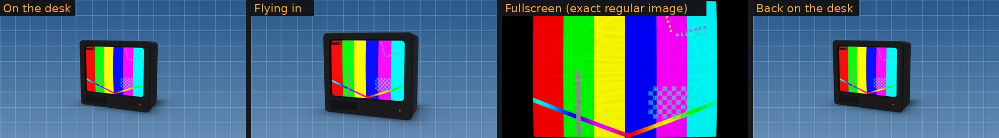

**Set** (right-click → *Set*):

- **CRT television** (default): the 90s set. Its glass bulges according to the preset's
  Curvature.
- **Flat-face CRT:** the same set with a flat glass front, like the late-90s "flat
  screen" tube TVs.
- **Flat-panel screen:** a slim display with thin bezels on a neck and base, a small
  white power LED, and a matte anti-glare screen that shows a soft sheen instead of
  sharp reflections. Portrait video pivots the panel, and its stand stays upright on
  the desk.
- **80s wood-grain console TV:** a boxy walnut-veneer cabinet on four tapered legs,
  with a fabric speaker grille, a chrome trim line, and two knobs (metal flange, fluted
  body, brushed-aluminium cap with an indicator line).
- **Broadcast monitor (PVM):** a boxy metal studio monitor with a row of front-panel
  buttons.
- **Beige PC monitor:** the classic deep beige CRT on a tilt-swivel foot.
- **Arcade cabinet:** an upright cabinet.
  - **Its parts:** a backlit marquee, a speaker panel, the monitor behind a black bezel,
    a two-player control panel (joysticks with ball tops, six lit buttons each and a
    start button), a coin door with glowing coin returns, and side art edged with
    T-molding.
  - **The marquee** shows the video's title, tidied up: `Oblivion.2013.1080p.BluRay.x264`
    becomes **OBLIVION**.
  - **Four art styles** (*Set → Arcade art*): **Space** (stars, a ringed planet, a neon
    grid), **Sunset** (a striped sun over mountains), **Neon** (stripes and triangles)
    and **70s woodgrain** (with a bold stripe).
  - **Vertical games:** a portrait video turns the monitor inside the cabinet, as in a
    vertical shoot-'em-up cabinet; the cabinet stays upright.
  - **In the scenes:** the cabinet always stands on the floor. In the wall-mounted scene
    it stands against the wall; in the 90s CG room the objects spread out around it.

The tube sets (all except the flat-face CRT and the flat panel) have glass that bulges
with the preset's Curvature.

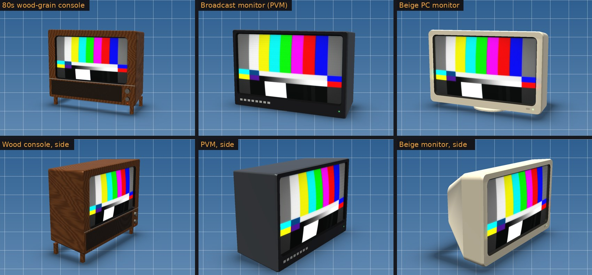

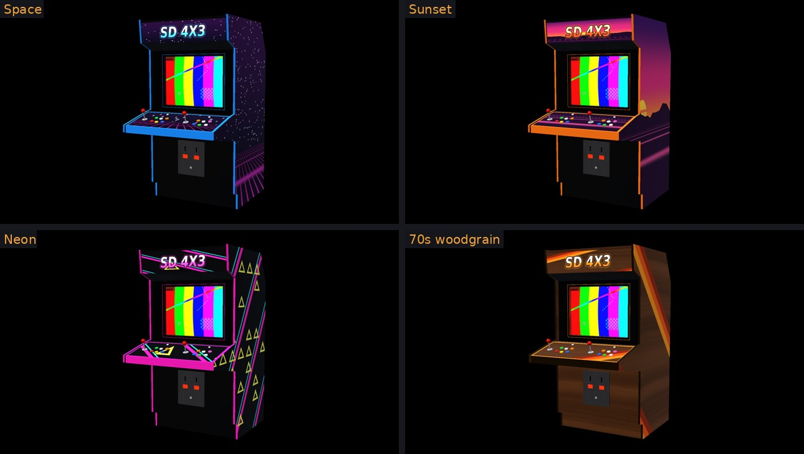

Your CRT effects still apply to the picture on every set; press **B** for a clean
picture on the flat panel. Every set flies into fullscreen the same way, and lands on
the same exact fullscreen image.

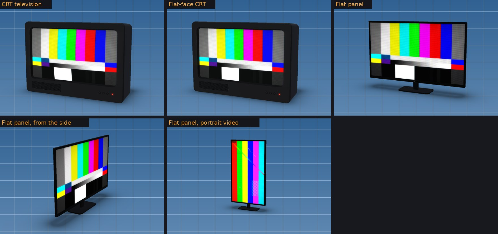

### Scenes

Right-click the set → **Scene** (or *Scene settings…* for a window with every option):

- **Your desktop:** the set on your transparent desktop, as before.
- **Desk:** the set on a wooden floor in a room, against a plastered wall with a skirting
  board.
- **Wall-mounted TV:** the set hangs on a wall, with your own pictures beside it.
- **Movie theater:** a big screen with curtains, in a cinema, with a film look.
- **90s CG room:** the set in an early-90s ray-traced world ("The Mind's Eye" style).

The *Scene settings* window shows a small preview of each scene, rendered from your
current view.

**What the desk scene does:**

- **The picture lights the room.** Its colour and brightness fall on the desk in front of
  the set, and bounce softly onto the wall. The desk's satin clear-coat reflects the
  screen at the right angles.
- **Mood:**
  - *Evening:* a warm lamp.
  - *Night:* the lamp dimmed.
  - *Lights off:* only the screen lights the room.

  The set's own lighting follows the mood.
- **Fog:** *light haze* or *thick fog*, with a strength slider. The fog drifts slowly, is
  denser near the desk, and glows in the picture's colours around the set.
- **Desk wood:** walnut, oak or cherry. The boards are ~15 cm planks with seams and end
  joints.
- **Quality:** fog detail. Lower it if desk mode stutters with fog on.

**The desk and wall-mounted scenes are real rooms:**

- side walls in the same finish as the back wall, with the skirting board running round;
- a plaster ceiling with a cornice;
- softly shaded corners;
- the lamp, the TV and the picture lights light them all.

The camera stays inside the room: not through a side wall, not above the ceiling.

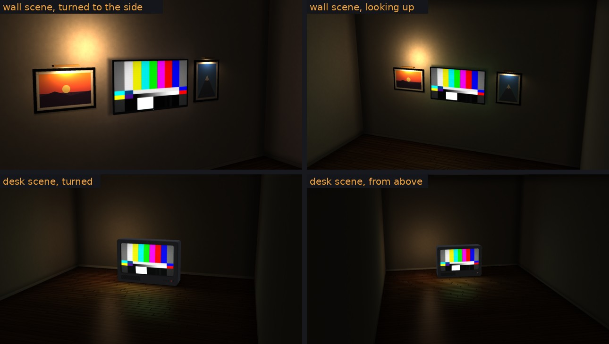

**The wall-mounted TV scene:**

- **The mount:**
  - CRT sets sit on a hotel-style tray with an articulating arm to a wall plate.
  - The flat panel hangs on a slim bracket.
  - The set casts a soft shadow on the wall, and its light spills around it.
- **Pictures:** choose up to four images from your files (*Scene settings → Wall and
  pictures*).
  - **Layout:** none, one on each side, two on the left, two on the right, or two on each
    side.
  - **Frames:** black, wood or gold moulding with a mat. Each frame takes its picture's
    shape.
  - **Beside a deep CRT,** the pictures hang further out, so they stay visible from an
    angle.
  - **Brass picture lights** above each frame wash the pictures in warm light (in the
    evening and night moods).
- **Wall:** warm white, sage green, navy or charcoal paint, or pinstripe or damask
  wallpaper.
- **The same moods and fog** as the desk scene. The floor is far below and uses the wood
  setting.
- **Placement:** *Scene settings → Wall and pictures* has sliders for:
  - **TV height** on the wall;
  - **picture height** (relative to the screen), **picture spacing** from the set, and
    **picture size**.

  The mount is dark metal whatever the set is made of.
- **Your pictures** are remembered; a picture that has been moved or deleted is skipped.

**The 90s CG room:**

- **The world:** an infinite **mirror checkerboard** (or a **neon grid**) under a gradient
  sky, fading into haze at the horizon, with a sun that casts hard shadows and a lens
  flare when you look towards it.
- **Objects**, in five sets (*Scene settings → 90s CG room → Objects*). All of them
  reflect in the floor and cast shadows.
  - **Chrome and marble** (the default): floating chrome spheres, a glass cube, a chrome
    ring and a marble column. They reflect the sky, the floor, each other and your
    picture.
  - **Toybox:** glossy plastic in saturated colours: a striped capsule, a cone, a twisted
    ring, a checked cube, an octahedron.
  - **Organic:** bumpy spotted and marbled forms, a glowing translucent jelly flower, and
    iridescent pearls.
  - **Wooden mannequins:** a troupe of jointed wooden figures walking a loop behind the
    set. Their feet stay planted and their hips rise and fall with each stride.
  - **Mixed:** some of each.
- **Background crowd** (on by default, whichever objects you choose): larger shapes of
  every kind floating in the distance, and wooden figures walking around behind the set.
  Switch it off in *Scene settings → 90s CG room → Background crowd* for the minimal
  look.
- **Your own 3D models:** *Scene settings → 90s CG room → Your 3D models → Choose
  folder…*. Up to 6 models from the folder become statues on marble plinths around the
  set, lit by the scene, casting shadows and showing in the mirror floor. They load in
  the background.
  - **What's read:**

    | Format | What is read |
    |---|---|
    | **OBJ** | Faces of any number of corners; normals; vertex colours; and, from the `.mtl` file beside it, each material's colour and picture (`Kd`, `map_Kd`). |
    | **STL** | Binary and text. |
    | **PLY** | Text, binary little-endian and binary big-endian; faces and triangle strips; normals; colours. A file with points and no faces is shown as a **point cloud** (see below). |
    | **GLB, glTF** | glTF 2.0: the scene's nodes (moved, turned, scaled), normals, colours per vertex, each material's colour and picture. A `.gltf` reads the `.bin` and picture files beside it. |
    | **FBX** | Binary and text, the versions in use since the 2000s, read by [ufbx](https://github.com/ufbx/ufbx): node transforms, normals, vertex colours, each material's colour and picture (inside the file, or beside it). |

  - **Which way is up:** FBX and glTF files say it themselves. OBJ, STL and PLY files do
    not, and programs disagree (Y in some, Z in others). The player looks for the model's
    **flat base**: a model that is flat underneath along Z and not along Y (or the other
    way round) is stood on that side. Without a flat side, an OBJ or PLY is taken as
    Y-up and an STL as Z-up. If a model still lies on its side, choose the axis in
    *Models stand* (Y, Z or X is up, or down); it applies to every model in the folder.
    The settings window lists each model with the axis used and why.
  - **Which way they face:** a file does not say which side is its front, so by default
    the statues **turn slowly** (one turn in 40 seconds). *Models face* can stand them
    still instead: as in the file, or turned by 90°, 180° or 270°.
  - **Finishes:** marble, bronze, chrome, candy plastic, or **their own colours**: the
    file's colours and pictures (textures). The statues are drawn with a colour at each
    triangle corner, so a picture is sampled there; a model of few triangles is divided
    into smaller ones first (up to about 150,000), so that its picture still shows. A
    picture comes out softer than in a 3D program, most of all on a model of a few dozen
    triangles.
  - **Point clouds** (a PLY of points, from a scanner or photogrammetry): each point
    becomes a small square lying in the surface. Normals are taken from the file, or
    worked out from each point's neighbours. Points far away from the rest are dropped.
  - **Large models:** a model of more than 400,000 triangles is **simplified** to fit
    (nearby corners are merged), up to 8 million triangles in the file; a point cloud of
    more than 200,000 points is thinned. Without a graphics card the limits are 120,000
    triangles and 60,000 points.
  - **Sizing:** models are centred, stood on their base and scaled to statue size. Files
    that have no normals get them: smooth over round shapes, with edges sharper than 60°
    kept.
  - **Files that can't be read are skipped,** and the settings window says why
    (*damaged or cut short*, *Draco-compressed*, …).
  - **Pictures:** PNG, JPEG, BMP and TGA always; TIFF and WebP with the AppImage, and in
    a build from source when Qt's image-format plugins are installed (Fedora:
    `qt6-qtimageformats`).
  - **Not read:** Draco- and meshopt-compressed glTF (export without compression); KTX2
    pictures (the material's plain colour is used); animation and skinning (a
    character stands in its rest pose); Gaussian-splat PLY files are shown as plain
    points, not splats.
  - **One limit:** they are not seen in the chrome spheres' reflections.
- **The TV** stands on a **chrome pedestal** or a **marble plinth**, or **floats**. Its
  picture glows on what is around it.
- **Palettes:** *Workstation* (teal), *Sunset* (orange and purple, with the sun in view),
  *Deep space* (stars and a ringed planet on the horizon).
- **Period touches:**
  - **Tile reveal:** when a video starts, or when you resume after a pause of 10 seconds
    or more, the picture resolves tile by tile, as if being ray traced. Skipping, scrubbing
    and short pauses don't trigger it.
  - **Demo-reel orbit:** once playback has been stopped for 10 seconds (and you haven't
    skipped or scrubbed), the camera slowly circles the set. It never turns while you
    scrub, skip or pause briefly.
  - **90s colour banding** (off by default).
- **The fly-in** is a sweeping camera move that arcs round into the screen.
- **The camera** can go all the way round, above the floor.
- **Quality** sets how many reflections of reflections are traced, and turns the shadows
  on or off.

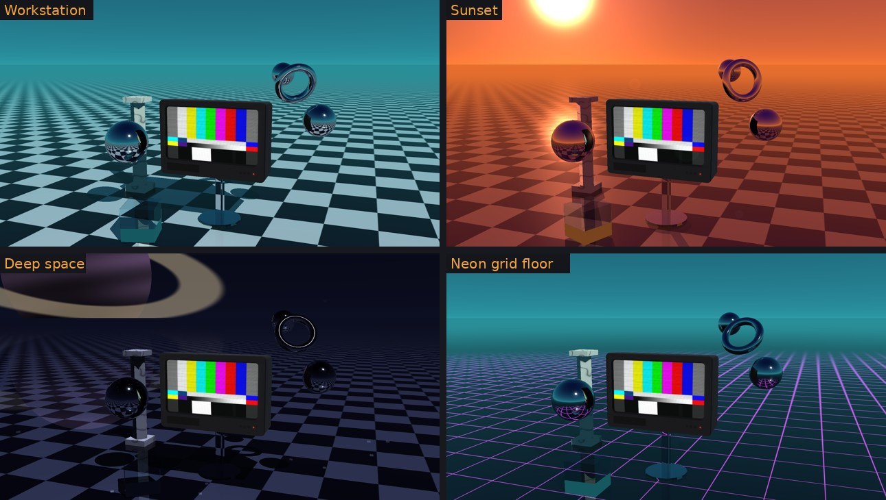

**The movie theater:**

- **The screen:** your picture on a big screen in a stage frame (a proscenium) with gold
  trim, under a scalloped velvet valance.
- **Curtains:** red velvet curtains **open when playback starts**, stay open while you
  pause part-way through, and **close at the end**.
- **House lights** dim as the curtains open. A pair of sconces either side of the stage
  stays faintly lit.
- **Masking:** black masking closes in to the film's shape (widescreen, 16:9, 4:3), and
  glides to the new shape when the next video is different.
- **You sit in the auditorium:** twenty rows of 3D stadium seating, each row a step
  higher than the one in front, with two aisles and step lights on the stairs. It is all
  one room with the screen, walls and sconces.
  - **Scrolling** moves you between rows, from row 3 to the back row.
  - **Dragging sideways** moves you along the row, inside the walls.
  - Your eye stays at seated height for the row you're in.
  - The theater uses a wide, human field of view, so you see the rows in front and the
    room.
- **Haze:** with fog on, the projector's beam shows in the air, carrying the picture's
  colours, with dust drifting in it.
- **The film look.** The theater shows the film look (*Film Print (35mm)*), and leaving it
  brings your own look back. Choose another in *Scene settings → Theater → Picture*:
  35mm print, worn 16mm print, drive-in, or keep my current look.
- The set you chose for the other scenes is kept; the theater has its screen instead.

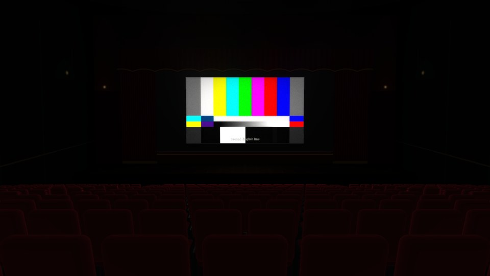

**Also:**

- **In the scenes, the camera stays above the floor.** Dragging, the gamepad stick and
  saved positions can't take it below the boards. On the transparent desktop the set can
  still be seen from below.
- The gamepad's **Menu** button switches scenes in desk mode.
- In Steam Game Mode the desk scene is always used, since there's no desktop to show.
- All scene settings are remembered.

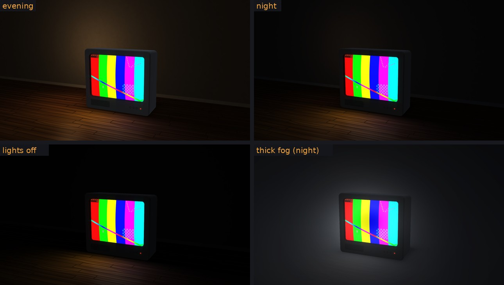

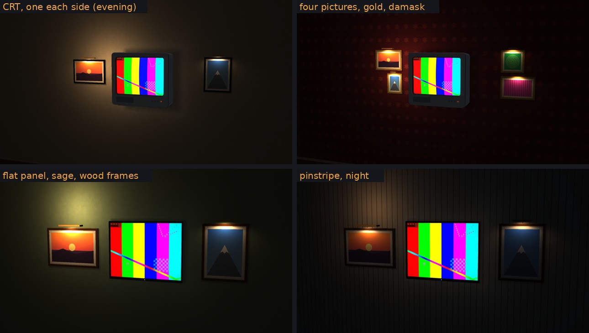

**Screen shape** (right-click → *Screen shape*):

- **Follow the video** (default): the tube takes the video's shape. Widescreen video
  gets a widescreen set, and portrait video gets the same set pivoted 90°, like a
  vertical arcade monitor. Very wide video (wider than 2.6:1) is letterboxed inside a
  2.6:1 tube.
- **Classic 4:3 tube:** always a 4:3 set, with other shapes letterboxed inside it, the
  way widescreen really looked on an old TV. Flying in then ends on that 4:3 picture.

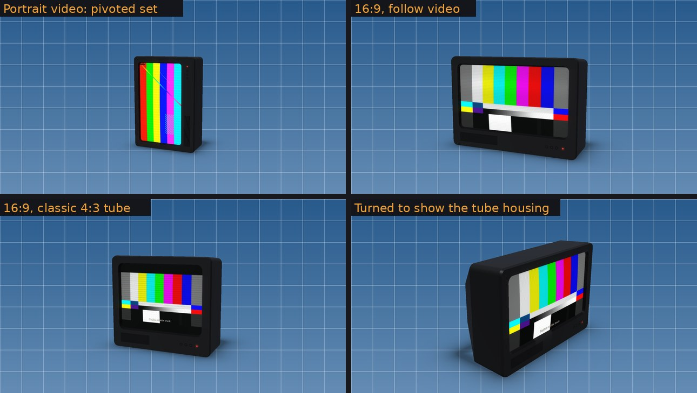

**How it looks.** The glass is real curved geometry, so its bulge follows the preset's
Curvature. All the CRT and analog effects play on it. The picture lights the tunnel
around the glass and faintly reflects on the bezel. The glass reflects a dim room
(stronger at grazing angles), and the set casts a soft shadow on the "desk" beneath it.
When you tilt the set until you're looking up from below that desk, the shadow fades
out, since it lies on the desk's upper side. Its click area disappears with it.

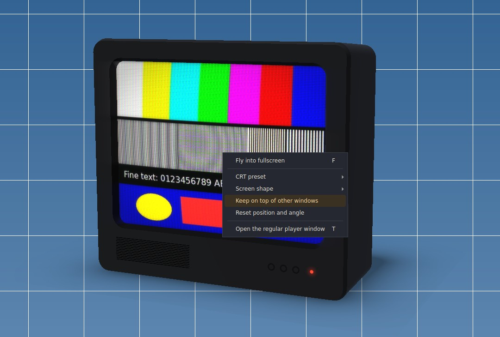

**What's remembered:** the position, angle, size, set, screen shape and *keep on top*.

**Where it works:**

- **KDE Plasma on Wayland** (Bazzite's default) and on X11, or any desktop with a
  compositor.
- On **Wayland** the set behaves like a normal window: other windows can go in front of
  it. Turn on *Keep on top* to stop that. Apps can't place themselves *behind* other
  windows on Wayland; a KDE window rule ("Keep below") can do it.
- **Steam Game Mode (gamescope)** has no desktop to show through, so desk mode
  automatically uses the room backdrop there.

---

## Cable TV

Turn a pile of videos into television. Each channel plays a folder's videos around the
clock, on a schedule that runs whether you're watching or not. Tune in and a programme
is already partway through, the way it was when you flipped on the TV in 1994.

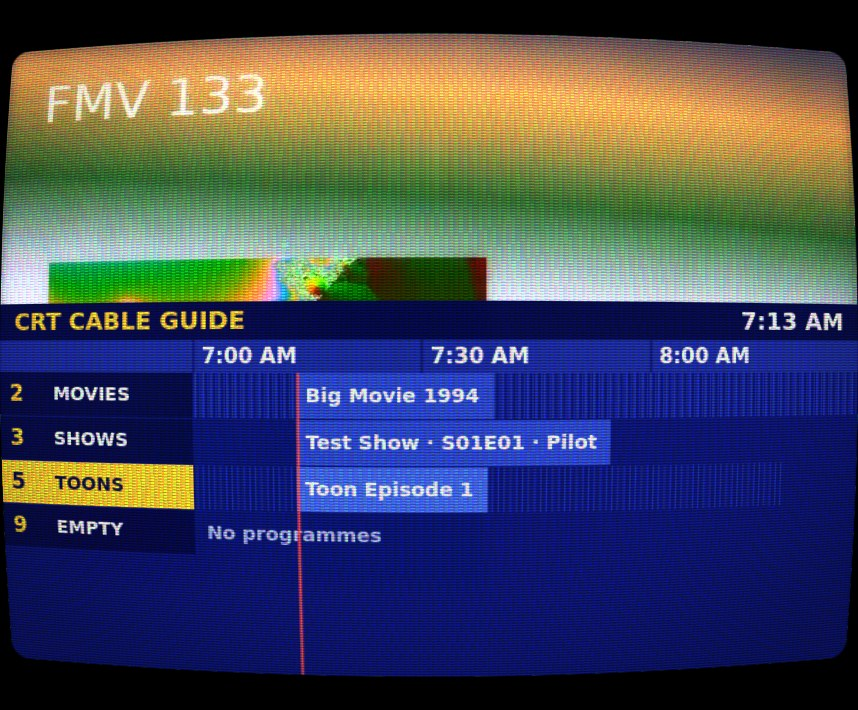

**Making channels** (*Settings → TV*):

- **Add folder…** makes one channel from a folder and everything in its subfolders.
- **Add each subfolder…** makes a channel for every folder inside the one you pick. A
  *Shows* folder with a folder per show becomes a channel per show.
- **Jellyfin:** in the Jellyfin panel, right-click a library, a series or a folder and
  choose **Add as TV channel**. The channel plays every episode and film inside it.
- For each channel you can set its **name** and **number**, and:
  - **Shuffled** (the default): a new order every time round. Off: name order, like a
    series from its first episode to its last, then again.
  - **Bumpers:** a folder of short clips (idents, old adverts, station breaks). One
    plays between every two programmes.
  - **Look for new videos** reads the folder again.

**Watching:**

| Key | Action |
|---|---|
| Ctrl+T | TV on/off. It comes back on the channel you last watched; turning it off stops the programme |
| Page Up / Page Down | Channel up / down |
| N / P, the ⏭ ⏮ buttons, the media keys | Channel up / down |
| 0–9 | Type a channel number; it tunes after a moment |
| W | The programme guide |

- **Changing channel** gives a burst of static, the channel number in green in the
  corner, and a banner with what is on now and what is next. A reminder of what is next
  comes up again as a programme ends.
- **The guide** covers the lower part of the picture and scrolls through the channels
  by itself, with the next hour and a half laid out against the clock. The programme
  carries on above it.
- **The schedule is fixed by the clock.** Leave a channel and come back ten minutes
  later, and it is ten minutes further on. Close the player and open it tomorrow, and
  the channels have carried on. Nothing is recorded or kept running to do this: what is
  on at any moment is worked out from the time of day and the lengths of the videos.
- **An empty channel** (or one whose videos can't be read) shows static and says so. A
  number with no channel says *not in use* and leaves you where you were.
- **It all goes through the set.** The channel number, banners and guide are part of the
  picture, so they curve with the tube and sit under the scanlines. It works in desk mode
  too: the 3D set changes channel.
- **Subtitles and languages carry over.** Subtitles on or off, and the languages you
  picked, hold from channel to channel.
- **Any look works,** and so do the scaling modes, audio and subtitle tracks, screenshots
  and volume. Seeking and pausing work as well; the channel catches up with its schedule
  at the next programme.
- **In desk mode,** right-click → *Cable TV* has on/off, the guide and the channel list.
- **Opening a file of your own** (or anything from the playlist or Jellyfin) turns the
  TV off.

**What TV mode leaves alone:** your playlist, your resume positions, and Jellyfin's
resume points and *watched* marks. Flipping past an episode doesn't count as watching it.

**The first time** a folder is added, the player reads the length of each video (a
moment per file; the list shows the progress). The lengths are remembered, so later
launches are instant. Jellyfin channels need you to be signed in; until then they show
*no signal*.

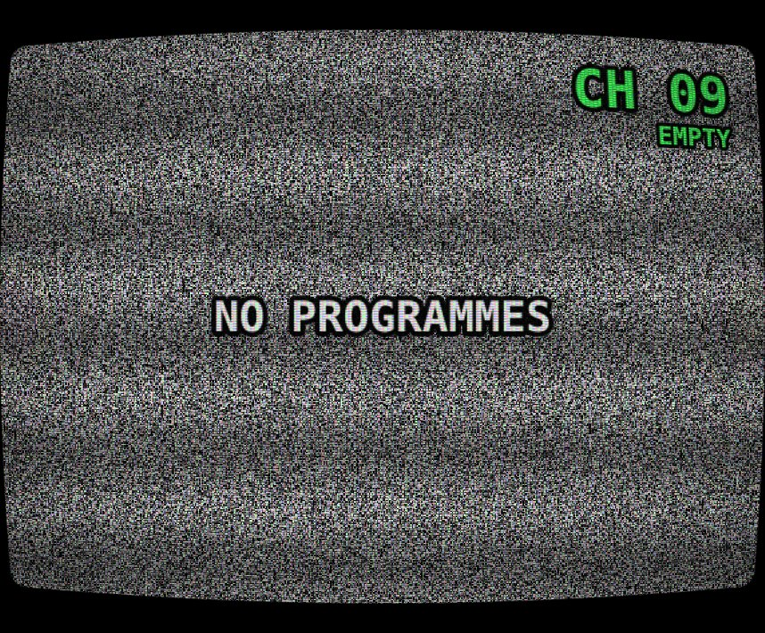

---

## Jellyfin

Open the **Jellyfin** panel with **Ctrl+J**, or with the server button in the control
bar.

**Signing in.** Enter your server's address (for example `http://192.168.1.20:8096`, or
your `https://` address), your user name and password.

- The player stores **only the access token Jellyfin issues**, never your password. It's
  kept in `~/.config/CRTPlayer/CRTPlayer/jellyfin.json`, readable only by you (0600).
- The player stays signed in across restarts.
- **Sign out** revokes the token on the server and removes it from disk.

**Browsing.** The home view shows **Continue watching** (with progress bars) and your
libraries. Folders, series and seasons open with a double-click; the search field
searches all libraries.

Big libraries load **100 items at a time**: the next 100 arrive as you scroll near the
end, and the heading shows how many are loaded (*Movies — 300 of 1,234*). There's no upper
limit.

**Playing:**

| Action | Result |
|---|---|
| Double-click a video | Plays it, resuming where you left off |
| Right-click → *Play from the beginning* | Plays from the start |
| Right-click → *Add to playlist* | Queues it; Jellyfin items and local files can be mixed |
| Right-click → *Play converted by the server* | Has the server convert it, even though this computer could play the original |

**Original file or converted by the server.** Before each video the player asks the
server how to play it. It sends the list of formats this computer's GStreamer can open
and decode.

- **Original file** ("direct play") whenever this computer can decode it. Everything
  works on it: every CRT effect, lower resolution, desk mode, screenshots, all audio and
  subtitle tracks in the file, and seeking (via HTTP range requests).
  - The lines of a text subtitle track in the file are fetched from the server as a
    file (2.16), so that the right line is there after every jump without reading the
    video a second time. If the server does not hand the track out, it is drawn as
    before (after a jump, from the next line on).
- **Converted by the server** when this computer can't decode the file (a codec it
  lacks), or when the file is over the **Quality** limit at the bottom of the Jellyfin
  panel. The server sends H.264 video with AAC audio as HLS, which plays and seeks
  normally, with every CRT effect. Subtitles in the file are offered as files from the
  server (*Subtitles* menu). Only one audio track comes with a conversion.
- **Quality:** *Original file* (the default) never limits. *Up to 40 … 1 Mbit/s* has the
  server convert anything above the limit: for a slow connection, or a server away
  from home.
- **If an original won't play here** (a codec GStreamer reports only once it opens the
  file, or a damaged file), the player asks the server for a conversion instead, once,
  and carries on from the same point.
- The technical info overlay (**I**) shows which it is: *Jellyfin — original file* or
  *converted by the server: video format*.

**The token:**

- For original files it travels in a request header, not in the address.
- A conversion's HLS segments are fetched separately, without the player's headers, so
  their addresses carry the token, as with Jellyfin's own apps.
- Either way it never shows up in the window title, playlist, info overlay, screenshots or
  logs. Playlist entries store only the item's ID and title, and become an authenticated
  stream when played.
- The server's conversion is ended when playback moves on.
- **Progress syncs back to the server.** Start, pause/resume, position every 10 seconds,
  and stop are all reported. Your resume points and *watched* marks stay in step with
  Jellyfin's other apps.

**Server versions.** The player reads the server's version and uses the matching API
routes. Jellyfin 10.9 moved several endpoints; both older and current servers are
supported.

**Current limitations:**

- **A conversion carries one audio track** (the file's default) and no embedded image
  subtitles (PGS/DVD). Text subtitles are offered as files.
- **HTTPS needs a certificate your system trusts.** A certificate from a public authority
  (for example Let's Encrypt behind a reverse proxy) works. Untrusted self-signed
  certificates are refused. Plain `http://` works on a home network.

---

## Videos from web sites

Copy a video's link in your browser, switch to the player and press **Ctrl+V**. Or press
**Ctrl+L** and type or paste the address, drag the link from the browser onto the player,
or start the player with the link (`crtplayer "https://…"`).

The video plays in the player like any other: with the look that is on, in desk mode,
with the same keys.

- **Which sites:** YouTube, and every other site that
  [yt-dlp](https://github.com/yt-dlp/yt-dlp) supports (over a thousand: Vimeo, Twitch,
  Dailymotion, the Internet Archive, many broadcasters' sites …).
- **Nothing is downloaded to disk.** The video is streamed. Jumping about in it works:
  the player fetches the part it needs, and keeps what it has read lately in memory, so
  short jumps back and forth need no new request.
- **Picture size:** the largest the site offers that your screen can show, up to 4K.
  *Settings → Playback → Videos from web sites → Picture size* sets a limit (*1080p at
  most*, *720p at most* …) for a slow connection or a slow computer. Without a graphics
  card the player asks for 1080p at most and for H.264 where the site has it, which is
  the cheapest to decode.
- **Subtitles:** the subtitle files a site offers are in the subtitle menu (right-click
  → *Subtitles*, or the control bar's subtitle button): those people wrote, in every
  language, and the automatic captions in the video's own language, marked
  *(automatic)*. With subtitles on (**V**), the one in the language you last picked
  loads by itself. Automatic captions arrive word by word with every line repeated;
  the player shows each line once, whole.
- **Chapters** from the page work as chapters do (Shift+PgUp / Shift+PgDn, the marks on
  the seek bar).
- **Playlists:** a playlist's link puts all its videos into the playlist panel (**L**),
  by their names; each is looked up when its turn comes. A saved playlist file
  (`.m3u8`) holds the pages' plain addresses, so other players can read it too.
- **Where you left off:** a web video goes on where you stopped it, like a file, and is
  in *Recent* by its name.
- **Live streams** play; there is nothing to resume in them.
- A link that is a **video file or stream itself** (`….mp4`, `….m3u8`, or an address
  whose server says it is video) plays directly, as before, without yt-dlp.

### yt-dlp

Video sites change how they hand out their videos every few weeks. yt-dlp is the free
program that follows them, kept up to date by its own project. The player does not
contain it: it **runs the yt-dlp on your computer**, asks it where the video on a page
is, and plays what it names.

**If you have none:** the first time you open a page, the player says so and offers to
fetch it. **Get yt-dlp** downloads the official program from its project
(`github.com/yt-dlp/yt-dlp`, about 40 MB) into the player's own folder
(`~/.local/share/CRTPlayer/CRTPlayer/tools/`). Nothing else on the computer is changed,
and the video you asked for then starts by itself. The download is checked against the
checksum its release publishes; one that does not match is not kept.

**For YouTube, yt-dlp also needs a JavaScript runtime** (since late 2025; without one,
YouTube offers it few versions of a video, or none). yt-dlp uses
[Deno](https://deno.com) for that. When the computer has none, the same button fetches
Deno too (from `github.com/denoland/deno`, a 42 MB download that unpacks to 95 MB,
checked against its release's checksum, into the same folder). If Node.js, Bun or QuickJS is installed, the player
points yt-dlp at that instead and fetches nothing.

**Which one is used:** the yt-dlp the player fetched, if there is one; otherwise the
one on your system (`PATH`, `~/.local/bin`, Homebrew, `/usr/local/bin`). *Settings →
Playback → Videos from web sites* shows which it is, its version and age, and which
JavaScript runtime it will be given. The button there says what it would do:

| The button | When | What it does |
|---|---|---|
| **Get yt-dlp** | there is none | fetches yt-dlp (and Deno, if there is no JavaScript runtime) |
| **Update yt-dlp** | the player has its own copy | fetches the newest one |
| **Get Deno (for YouTube)** | your system has yt-dlp but no JavaScript runtime | fetches only Deno |
| **Use the newest yt-dlp instead** | your system has yt-dlp | fetches a copy for the player, which it then uses and can keep current |

**When a site stops working**, the first thing to try is that button: an old yt-dlp is
by far the most common reason. When yt-dlp fails and is more than two months old, the
error says so.

To install yt-dlp yourself instead (the player finds it):

```
brew install yt-dlp deno
```

or, without Homebrew:

```
mkdir -p ~/.local/bin && curl -L https://github.com/yt-dlp/yt-dlp/releases/latest/download/yt-dlp_linux -o ~/.local/bin/yt-dlp && chmod +x ~/.local/bin/yt-dlp
```

### How it is played

YouTube, and most large sites, serve everything above 360p as **two separate streams**:
the picture at one address, the sound at another. GStreamer's player opens one address.
The player therefore has a source of its own that reads both and hands them on as the
picture and the sound of one video: they start together and jump together.

- Each stream is read into a buffer in memory (32 MB for the picture, 4 MB for the
  sound): up to 24 MB ahead of the place being played, the rest behind it. A jump to a
  place outside it asks the server for exactly that part of the file, by byte range:
  three requests for a jump in a 90 MB test file, whether ahead or back. Playing on
  needs no further requests.
- **When the network is slow or away**, the video waits (*Waiting for the network…*)
  and goes on with the picture it stopped at once about three seconds are at hand
  again. Nothing is skipped. (Without this, the clock would run on without a picture
  and the video would go on wherever the clock had got to: in a test with the network
  away for six seconds, 7.5 seconds of the video were never shown.)
- Every jump is an exact one in a two-stream video, also while you drag the seek bar. A
  quick jump "to the nearest keyframe" would take the picture and the sound each to a
  keyframe of its own (measured: 1.4 seconds apart). Shift+← / Shift+→ move five seconds
  there.
- The streams' addresses **stop working after a few hours** (YouTube: about six). If
  that happens while a video is paused, the player asks yt-dlp for new ones, once, and
  goes on at the same place. Only the page's address is ever kept (in the playlist, in
  *Recent*), never the streams' own.
- What the site wants sent along (who is asking, the page the request comes from,
  cookies) goes with every request, for the streams and for subtitle files.
- Sites that send a video as an **HLS or DASH manifest** are played through GStreamer's
  own support for those; there the picture size is GStreamer's choice.
- Press **I**: the *Web* line shows the site, the picture size and the codecs.

### Good to know

- Looking a video up takes yt-dlp a few seconds (YouTube: 3 to 10). The picture area
  says *yt-dlp is finding the video…* meanwhile. Opening something else in that time
  simply drops the question.
- **HDR versions are not asked for** (the player shows standard dynamic range), nor
  codecs your GStreamer cannot decode.
- Videos that need you to be **signed in** (age-restricted, members-only, private) do
  not work: the player gives yt-dlp no browser cookies.
- Cable TV channels cannot be made of web videos.
- The player asks yt-dlp one question at a time and downloads nothing through it. What
  you may watch from a site is between you and that site's terms.
- For tests: `CRTPLAYER_TOOLS_PATH` (folders, separated by `:`) replaces the places
  yt-dlp and the JavaScript runtimes are looked for; `CRTPLAYER_YTDLP_RELEASE` and
  `CRTPLAYER_DENO_RELEASE` replace the addresses the button fetches from. To use a yt-dlp
  somewhere else, set `ytDlpPath` under `[online]` in `CRTPlayer.conf`.

---

## Where settings are stored

| What | Where |
|---|---|
| Window, volume, scaling, crop, current CRT settings, playlist, screenshot options, desk position | `~/.config/CRTPlayer/CRTPlayer.conf` |
| User presets | `~/.local/share/CRTPlayer/CRTPlayer/presets/*.json` |
| Jellyfin sign-in (server, user, access token, device ID; never the password) | `~/.config/CRTPlayer/CRTPlayer/jellyfin.json` (owner-only) |
| Resume positions (local files; web videos by their page's address) | `~/.local/share/CRTPlayer/CRTPlayer/resume.json` |
| yt-dlp and Deno, when the player fetched them ([Videos from web sites](#videos-from-web-sites)) | `~/.local/share/CRTPlayer/CRTPlayer/tools/` |
| Recent files | in `CRTPlayer.conf` |
| TV channels (folders, names, numbers, video lengths; no sign-in details) | `~/.config/CRTPlayer/CRTPlayer/channels.json` |
| NVIDIA AI: the SDK you installed (not the player's; listed here so that you can find it) | `~/.local/share/crtplayer/VideoFX` |
| NVIDIA AI: what the helper and NVIDIA's libraries printed, last runs | `~/.cache/CRTPlayer/CRTPlayer/nvfx.log` |

Settings are saved whenever the player exits: window close, Ctrl+Q, or logout.

---

## Troubleshooting

**Windows: in full screen, the list of looks (or a menu) did not appear, though clicking where
its lines should be still picked one; desk mode had black around the set, and ran unevenly**
(before 2.16.1)

- Fixed in 2.16.1, as far as that can be said without the graphics card it happened with:
  see *Full screen and desk mode stop one pixel short of the screen's edge* under
  [Windows 10 and 11](#windows-10-and-11-preview).
- Should desk mode still show black around the set on an NVIDIA card: in the NVIDIA Control
  Panel, under *Manage 3D settings*, the setting *Vulkan/OpenGL present method* set to
  *Prefer native* is reported to bring back see-through windows in other programs with the
  same symptom (not tried with this player).

**A link does nothing, or "yt-dlp could not find the video"**

- Press **Ctrl+L** and paste the address there: a link is only taken from the clipboard
  (**Ctrl+V**) when it begins with `http://` or `https://`.
- **Update yt-dlp first**: *Settings → Playback → Videos from web sites* has the button.
  Sites change every few weeks and an older yt-dlp stops finding their videos; the
  line above the button says how old yours is.
- **YouTube offers only a small picture, or "Requested format is not available":**
  yt-dlp has no JavaScript runtime. The same settings line says so, and the button
  fetches Deno.
- **"Sign in to confirm you're not a bot"**, age-restricted or members-only videos:
  the site wants a signed-in browser, which the player does not provide.
- The error dialog's *Show Details* has everything yt-dlp printed. To ask it yourself
  (the answer is long; its last lines say what is wrong):

  ```
  yt-dlp --dump-single-json "https://…" | tail -c 400
  ```

**"The site would not send the video"**

yt-dlp found the video, the player asked for it, and the site's server refused (the
dialog names the answer, usually *Forbidden*). The player has by then asked yt-dlp for
fresh addresses once. Update yt-dlp (above); if it is current, try again later: some
sites refuse for a while after many requests.

**A web video's picture and sound drifted apart, or the sound stopped after a jump**

Please report it, with the page's address and what **I** shows in its *Web*, *Video*
and *Audio* lines. As a stopgap, a smaller picture size (*Settings → Playback → Videos
from web sites*) often makes a site send one file with both.

**No subtitles**

- Subtitles are off until you turn them on: press **V**, or pick a track from the
  subtitle button. From then on they stay on, in every video.
- After a jump the line is there at once (2.16). Picture subtitles (DVD, Blu-ray) are
  the exception: they come back with the next line.
- To see what the player does with a video's subtitle lines, start it from a terminal
  with `CRTPLAYER_SUBTITLE_TRACE=1` (every step is printed). `CRTPLAYER_SUBTITLE_FEED_OFF=1`
  switches back to how 2.15 drew subtitles.

**After a jump the picture stood still for seconds, while the sound went on** (before 2.16)

- Fixed in 2.16. It happened in Matroska files whose subtitle lines are stored well
  ahead of the picture (files written by programs other than mkvmerge often are), most
  visibly with ten seconds between keyframes: on meeting such a line, GStreamer told the
  video decoder that the picture was lagging, and the decoder threw away what it held.

**The player froze after a jump at another playback speed** (before 2.16)

- Fixed in 2.16. Seen with MPEG-TS recordings at 2× or 0.5×: a timing notice passing
  through the speed filter came out with a time hundreds of years ahead, the sound
  output waited for it, and the next jump could not interrupt that wait.
- *This video has none* in the message means the file carries no subtitle track and no
  subtitle file sits next to it.

**The player froze after changing the sound track while paused** (before 2.11)

- Fixed in 2.11. A sound track picked while paused, or while a video opens, is now
  switched in when the video runs.

**"Missing codec or GStreamer plugin: H.265 (Main Profile) decoder"** (or similar)

- The message names exactly what GStreamer could not find.
- On Bazzite most codecs are preinstalled. Check with
  `gst-inspect-1.0 | grep -i -E 'dec|demux'`.
- Proprietary codecs usually come from `gstreamer1-plugin-libav`,
  `gstreamer1-plugins-bad-freeworld` or `gstreamer1-plugins-ugly`. Layer them with
  `rpm-ostree install …` and reboot.
- If only the audio decoder is missing, the video still plays and a notice names the
  missing audio decoder.

**A video stays on its last picture and the playlist does not go on** (2.11 to 2.12.1)

- Fixed in 2.13. It happened when a subtitle track was switched to (by hand, or by your
  preferred language) after the file had already delivered its last subtitle line: in a
  short clip, or near the end of a film. The video then never reported its end.
- In those versions, any jump in the video gets past it.

**"Hardware decoder … failed; switched to software decoding" on every video** (2.12.0)

- A fault in 2.12.0 on systems with a hardware decoder (seen with NVIDIA): fixed in
  2.12.1. The video still played, decoded by the CPU.
- If the message appears with 2.12.1 or later, the decoder itself failed (a driver
  mismatch after an update is the usual cause); playback carries on in software.

**Video plays slowly in a virtual machine** (or anywhere without a graphics card)

- Press **I**. If the *Drawing* line says *no graphics acceleration (software OpenGL)*,
  everything is drawn by the CPU. See [Without a graphics card](#without-a-graphics-card).
- With effects off (**B**), 1080p and 4K H.264 should play at full rate from 2.12. If
  they don't, check that *Settings → Playback → Decoding → CPU fast path* is *Automatic*
  or *Always*, and give the virtual machine more CPU cores.
- With a look, choose *Look detail: Half size*, a smaller window, or a lighter look.
- 4K HEVC 10-bit is heavy to decode and convert on the CPU alone: it needs more cores
  than 4K H.264.

**"OpenGL 3.3 is required" or a black video area**

- Check the driver with `glxinfo -B` (X11) or `eglinfo` (Wayland).
- On NVIDIA, make sure the proprietary driver is active (Bazzite's `-nvidia` images).
- Try the other platform: `QT_QPA_PLATFORM=xcb ./crtplayer` or
  `QT_QPA_PLATFORM=wayland ./crtplayer`.

**Hardware decoding**

- *Picture → Playback* lists the decoder in use and which hardware decoders GStreamer
  knows about. Press I to see it live.
- If a hardware decoder errors, the player reopens the file in software at the same
  position and says so.
- To rule out hardware decoding entirely, uncheck it or start with `--no-hw`.
- VA-API needs the `va` GStreamer plugin plus Mesa's VA drivers
  (`mesa-va-drivers-freeworld` on Fedora-based systems for H.264/HEVC).
- Vulkan video decoders are deliberately not prioritised, because they cannot hand
  frames to this renderer in system memory.

**Stutter or dropped frames**

- The composite and tape effects are the most expensive part of the shader, at about
  25 extra texture reads per pixel. They're cheap on any real GPU, but on an old
  integrated GPU at 4K, turn off Dot crawl, Rainbow and Tape softness first.
- Press I and look at *A/V sync*. It shows how late each frame reaches the screen
  relative to the audio clock.
- If it stays high, try Bypass (B). If Bypass helps, lower Bloom/Glow or use a smaller
  window.
- Pixel-format conversion happens on the CPU only for unusual formats such as 10-bit.
  NV12/I420 go straight to the GPU.

**`error while loading shared libraries`** when running the prebuilt binary

- Your system lacks a Qt or GStreamer library, or has an older one.
- Use `scripts/build-bazzite.sh` to build against your own system.

**HDR (PQ/HLG) video looks washed out**

- The renderer works in SDR and does not tone-map. 10-bit sources are converted to
  8-bit.

**Subtitles look like they are "on the TV"**

- They are. Subtitles are drawn into the frame before the CRT pass, so they receive the
  same curvature and scanlines as the picture.

**The settings panel doesn't react to the mouse wheel**

- That's deliberate. Scrolling over the panel scrolls it, rather than changing
  whichever slider is under the pointer. Click a control first if you want to adjust it
  with the wheel.

**Desk mode: black around the TV instead of the desktop**

- Your session has no compositor, or it's gamescope. On KDE, check
  *System Settings → Display → Compositor* ("Enable on startup").
- On **X11**, some window managers stop compositing for fullscreen windows. KDE's
  "Allow applications to block compositing" option is one such trigger. Desk mode uses
  a fullscreen transparent window.

**Desk mode: clicks near the TV don't reach the window behind**

- The set, its soft shadow and the control strip (while visible) take clicks. On
  **X11** the clickable area includes the shadow, because there the window's shape
  also limits what can be drawn. On Wayland only the set's outline and the strip are
  clickable.

**90s CG room: one of my 3D models lies on its side, or is missing**

- **Lies on its side or stands on its head:** the file does not say which way is up, and
  the model has no flat base to go by (or has a flat side that is not its base). Choose
  the axis in *Scene settings → 90s CG room → Models stand*. It applies to every model in
  the folder, so keep models that need different choices in different folders.
- **Shows its back:** set *Models face* to *Turned by 180°* (or leave the statues
  turning).
- **Missing:** the settings window lists what was skipped, with the reason. *Draco-* or
  *meshopt-compressed*: export the GLB again without compression. *More than 6 models*:
  the first six by name are shown.
- **Grey with "Their own colours":** the file has no colours, or its picture files are
  not beside it (an OBJ needs its `.mtl` and the pictures that names; a `.gltf` its
  `.bin` and pictures).

**NVIDIA AI: "not installed", or "could not be used"**

- *Not installed*: the player found no SDK. It looks in `~/.local/share/crtplayer/VideoFX`
  first; that folder must contain `lib/libVideoFX.so`. See
  [NVIDIA AI](#nvidia-ai-upscaling-and-frame-generation-rtx-cards) for the steps.
- *The SDK is installed, but neither Video Super Resolution nor Video Frame Generation
  is in it*: the second half of the installation (`install_feature.sh`) is missing; the
  folders `features/nvvfxvideosuperres` and `features/nvvfxvideoframegeneration` are what
  it adds.
- *Could not be used:* followed by the reason NVIDIA's library gave. The video plays
  with the built-in methods meanwhile. `~/.cache/CRTPlayer/CRTPlayer/nvfx.log` has what
  the libraries printed, and `crtplayer-nvfx --probe` tries both effects outside the
  player and says which sizes and settings work on your card.
- Video Super Resolution is asked for the size the picture is shown at, whatever that
  comes to (in real use a 576×1024 video at 1032×1836 worked). Should a size be refused,
  the line says so; full screen, or another window size, is the thing to try.
- The pictures a second stay below the screen's rate: each picture takes too long for
  it. Lower *AI motion* to Fast or *AI upscaling* to Low, or turn one of the two off.

**The AppImage opens, but the video area stays empty or see-through**

- 1.9.2 and later use your system's Qt when it's suitable, which fixes this on Bazzite.
- If it still happens, try `CRTPLAYER_QT=bundled ./CRT_Player-…AppImage`, and send the
  system report (*Settings → Playback → Copy system report*).

**The screen dims while watching**

- Check that *Settings → Playback → Keep the screen awake while playing* is on.
- The system report's *Keep awake* line shows whether the desktop accepted the request.

**"Some videos won't play yet" / "GStreamer is incomplete"**

- CRT Player decodes with your system's GStreamer plugins, and the message lists what's
  missing and the command for your distribution. See
  [Other Linux distributions](#other-linux-distributions).
- On Arch, the usual missing piece is `gst-plugins-good` (plus `gst-libav` for H.264 and
  AAC).

**Jellyfin: "connection refused", "not found" or "did not answer in time"**

- Check the address and port. Jellyfin uses 8096 for `http://` and 8920 for `https://`
  by default; the Jellyfin web page in your browser shows the right address.
- If the server is on another computer, make sure its firewall allows the port.

**Jellyfin: "Secure connection failed"**

- The server's certificate isn't trusted by this system (usually a self-signed one).
- Use `http://` on the home network, or a certificate from a trusted authority.
  Alternatively, add your own certificate authority to the system trust store, which
  both parts of the player (the API and the video stream) use.

**Jellyfin: a video won't play, but browsing works**

- The file's codec may be missing on this computer. The error names it, as it would for
  a local file.
- Streams use GStreamer's HTTP source (`souphttpsrc`, in `gstreamer1-plugins-good`),
  which Bazzite includes.

**Resetting everything**

```bash
rm ~/.config/CRTPlayer/CRTPlayer.conf
```

This keeps your user presets.

---

## Code layout

```
src/
  main.cpp                 entry point, OpenGL format, CLI
  playback/Player.*        GStreamer playbin + appsink, seeking, tracks, decoder policy, errors
  playback/SubtitleFeed.*  the subtitle lines the player keeps itself: reads them out of the video or a
                           subtitle file, hands the right ones to the overlay after every jump
  playback/AssScript.*     reads an ASS / SSA subtitle file (unit-tested)
  render/Geometry.*        pure aspect/scaling/orientation math (unit-tested)
  render/CrtRenderer.*     GL resources: frame upload, conversion, blur, CRT pass, offscreen capture
  render/Enhance.cpp       Enhance: the upscaling passes, the motion search and the generated in-between
                           frames (part of CrtRenderer)
  render/NvEnhancer.*      NVIDIA AI for Enhance: starts the helper, talks to it, shares the pictures' memory
  render/GlSurfaceWidget.* the video's window surface: an OpenGL widget with a graphics card; without one, a
                           plain widget that paints frames itself and draws looks off screen
  render/VideoWidget.*     the video view: layout, compare divider, screenshots, sync statistics
  settings/CrtParams.*     parameter model, parameter table, built-in presets, preset JSON
  settings/PresetManager.* user presets on disk (save/rename/delete/import/export)
  settings/AppSettings.*   persistent settings (QSettings)
  ui/                      control bar, CRT/Display/Playback/Playlist panels, theme, vector icons,
                           WheelGuard (wheel scrolls panels, not sliders)
  app/MainWindow.*         wiring, shortcuts, fullscreen and auto-hide, overlays
  app/Everyday.cpp         subtitles and languages that carry over, delays, night mode, shuffle / repeat,
                           playlist files, the next video in a folder, the sleep timer (part of MainWindow)
  app/EnhanceUi.cpp        Enhance: the settings and the sound's delay (part of MainWindow)
  app/FastPath.cpp         playback without a graphics card: which frames the pipeline delivers (as decoded,
                           converted, converted and scaled) and at what size the look is drawn (part of MainWindow)
  app/Online.cpp           videos from web sites: links, yt-dlp's answers played, its settings (part of MainWindow)
  online/OnlineVideo.*     asks yt-dlp what a page holds and reads its answer; fetches yt-dlp and Deno (unit-tested)
  playback/WebSource.*     a GStreamer source of the player's own: the picture and the sound of a web video,
                           each from its own address, each through a buffer that can be read at any place
  playback/ShrinkFilter.*  without a graphics card: 10- and 12-bit pictures to 8 bits, and smaller by a whole
                           factor, in one pass (ShrinkKernel.h, unit-tested)
  playback/FrameGovernor.* when the computer cannot decode every picture in time: leaves out, before decoding,
                           pictures no other picture is built from (unit-tested)
  app/Automation.*         scripted driver used for verification
  app/DeskWindow.*         desk mode: transparent screen-sized window, input mask, control strip
  app/WinWindow.*          Windows: full-screen windows drawn with OpenGL stay part of the desktop (a pixel of border)
  jellyfin/JellyfinClient.* Jellyfin API: sign-in, browsing, images, stream URLs, playback reporting
  ui/JellyfinPanel.*       sign-in form and poster browser
  render/DeskRenderer.*    procedural 3D cabinet, projection, silhouette, shading
  render/DeskView.*        desk mode view: poses, flight, crossfade to flat, mouse interaction
  render/ModelLibrary.*    your 3D models: which way is up, normals, pictures, point clouds, simplifying (unit-tested)
  render/ModelFormats.cpp  the readers: OBJ (+MTL), STL, PLY, glTF / GLB, and FBX through third_party/ufbx
  edit/LosslessCutter.*    cutting without re-encoding (parsebin → muxer, keyframe start, decode-order end)
  edit/GifEncoder.*        animated GIF writer (median-cut palettes, dithering, LZW, parallel)
  edit/GifRecorder.*       steps through a section and has each frame drawn at the GIF's size
  render/FmvPalette.*      Sega CD FMV look: screen grid, per-frame palette from the console's 512 colours
  tv/TvSchedule.*          Cable TV: what is on a channel at any moment (pure, unit-tested)
  tv/TvController.*        Cable TV: channels, scanning, tuning, the channel display, banners and guide
  ui/TvPanel.*             the TV tab
  ui/CutDialog.*, ui/GifDialog.*  the two dialogs
shaders/                   quad.vert, convert.frag, downsample.frag, blur.frag, crt.frag,
                           plain.frag (effects off: a small program of its own),
                           enh_upscale.frag, enh_sharpen.frag (Enhance: upscaling),
                           fi_luma.frag, fi_flow.frag, fi_blend.frag (Enhance: frame generation),
                           fmv_codec.frag, fmv_palette.frag (Sega CD FMV look),
                           desk.vert, desk.frag (3D cabinet, glass, shadow)
tools/nvfx/                crtplayer-nvfx, the helper that runs NVIDIA's Video Super Resolution and Video Frame
                           Generation (no Qt): NvProxy (opens the SDK's libraries at run time), NvFx (the two
                           effects, and the two together), Serve (at work for the player; the protocol is in
                           NvShm.h), main (--probe, --where)
tests/                     unit tests + automation scripts
tests/nvfx_mock/           a stand-in for NVIDIA's SDK (plain arithmetic), for checks without an NVIDIA card
tests/web_mock.py          a small video site, and tests/fake_ytdlp.py, a stand-in for yt-dlp that answers as the
                           real one does for YouTube (video sites cannot be reached from where the tests run)
third_party/ufbx/          the FBX reader (ufbx, unmodified; MIT or public domain)
third_party/nvidia-vfx/    the NVIDIA Video Effects SDK's three API headers (NVIDIA, MIT)
scripts/                   build-bazzite.sh, install-local.sh, make-test-media.sh, run-verification.sh,
                           check-effects.py, check-desk.py (measure the captures),
                           run-jellyfin-tests.sh + check-jellyfin.py (with tests/jellyfin_mock.py),
                           check-online.py (videos from web sites),
                           build-appimage.sh
```

---

## Verification

[VERIFICATION.md](VERIFICATION.md) lists the samples and aspect ratios that were
actually tested and what was measured. It also separates tested behaviour from
behaviour that is only intended.

To reproduce the checks:

```bash
scripts/make-test-media.sh /tmp/crt-media           # needs ffmpeg
scripts/run-verification.sh build/crtplayer /tmp/crt-media /tmp/crt-results
```
